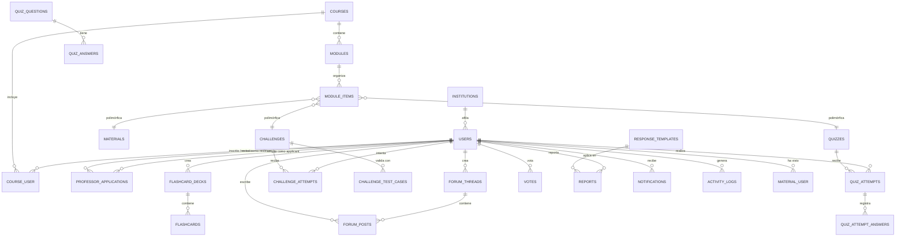

# Planificación de Backend y Diseño de Base de Datos para Prolecom

Este documento contiene la planificación completa para el backend y la base de datos de **Prolecom (Programming Learning Community)**, diseñado como una **REST API versionada** en **Laravel 12**. Este backend dará servicio al frontend desarrollado en React y a una futura aplicación móvil, integrándose con **Judge0 autoalojado** para la ejecución y evaluación segura de código. El despliegue se realizará con **Docker Compose**.

> **Directriz de Arquitectura Innegociable (Pragmatic Clean Architecture)**:
> 1. **Capa de Transporte**: Los Controladores (`Controllers`) NO deben contener lógica de negocio. Solo se encargan de recibir requests, delegar y formatear la respuesta JSON.
> 2. **Capa de Dominio**: Toda la lógica de negocio (FSMs, validaciones complejas, cálculo de XP) debe residir estrictamente en **Servicios de Dominio** o **Use Cases / Actions**.
> 3. **Capa de Infraestructura (Persistencia)**: Los Repositorios acceden a Eloquent, pero el Dominio no depende de detalles de Base de Datos.
> 4. **Atomicidad estricta**: Toda operación que modifique estados sensibles (XP, intentos de quiz) DEBE envolverse en transacciones de base de datos (`DB::transaction`) y utilizar **Pessimistic Locking (`lockForUpdate()`)** para evitar race conditions.

---

## 1. Arquitectura del Sistema

El backend se comportará de manera desacoplada del frontend (Headless) y expondrá recursos a través de una API JSON versionada (`/api/v1/`).

```mermaid
graph TD
    ReactApp["React Frontend (SPA)"] -->|Peticiones REST API / JSON| LaravelAPI["Laravel 12 API Backend"]
    MobileApp["App Móvil Flashcards (Futuro)"] -->|Bearer Token + JSON| LaravelAPI
    LaravelAPI -->|Lectura / Escritura SQL| MySQL["MySQL 8.x"]
    LaravelAPI -->|Almacenamiento de PDF / Imágenes| Storage["Laravel Storage (Local → S3)"]
    LaravelAPI -->|Ejecución de Código (Colas)| Judge0["Judge0 Sandbox (Docker)"]
    Judge0 -->|Resultado de Ejecución| LaravelAPI
    LaravelAPI -->|Email eventos críticos| SMTP["Servidor SMTP"]
```

### Stack Tecnológico Definido
| Componente | Tecnología |
| :--- | :--- |
| Framework | Laravel 12 |
| Base de Datos | MySQL 8.x |
| Autenticación | Laravel Sanctum (Bearer tokens) |
| Roles y Permisos | Híbrido: `spatie/laravel-permission` (Globales: unifica **Support Staff** y **Supervisor** bajo el rol `support`) + Lógica de curso en `course_user`. |
| Ejecución de Código | Judge0 CE (Docker) - Procesamiento **Asíncrono con Queues** |
| Colas | Redis — exclusivamente para Jobs de Judge0 y despacho de notificaciones asíncronas |
| Tiempo Real | Laravel Reverb (WebSockets) para notificaciones y actualizaciones en tiempo real. Sin mensajería privada. |
| Almacenamiento | Laravel Storage (disco local, migrable a S3) |
| Despliegue | Docker Compose (Laravel + MySQL + Redis + Judge0 + Worker) |
| Testing | Pest PHP / PHPUnit |

---

## 2. Diseño de la Base de Datos (Esquema Relacional Completo)

Para satisfacer todos los requerimientos funcionales descritos en el UML y los casos de uso, se propone el siguiente esquema relacional con sus restricciones de integridad y tablas intermedias.

> **Total: 27 tablas** (incluyendo tablas nativas de Sanctum y Laravel Notifications).



### Detalle de Tablas y Atributos (DDL Conceptual)

---

#### 2.1 Tabla: `institutions`
Representa una institución educativa, bootcamp o empresa que agrupa usuarios. Se usa para auto-detección durante el registro (por dominio de email) y para filtrar analíticas institucionales.
*   `id` (Unsigned BigInt, PK, Auto Increment)
*   `name` (Varchar 255, Unique)
*   `slug` (Varchar 255, Unique) — Identificador URL-amigable de la institución.
*   `domain` (Varchar 100, Nullable, Unique) — Ej: `espol.edu.ec`. Para auto-detección durante el registro.
*   `logo_path` (Varchar 255, Nullable)
*   `website` (Varchar 255, Nullable) — URL del sitio web de la institución.
*   `type` (Varchar 50) — Tipo de institución (e.g., 'university', 'bootcamp', 'company').
*   `created_at` / `updated_at` (Timestamp)

---

#### 2.2 Tabla: `users`
Contiene la información de autenticación, reputación global y estado de la cuenta. Los roles globales se gestionan de forma dinámica vía `spatie/laravel-permission` (`admin`, `support`, `moderator`, `professor`, `student`).
*   `id` (UUID CHAR 36, PK)
*   `name` (Varchar 255)
*   `email` (Varchar 255, Unique)
*   `password` (Varchar 255) — Hasheada con **Argon2id**.
*   `avatar_path` (Varchar 255, Nullable) — Foto de perfil.
*   `status` (Varchar 50) — Estado del usuario (e.g., 'active', 'suspended', 'banned', 'deactivated'). Requerimiento para moderación (`RF-MOD-02`) y desactivación segura (`RF-SUP-01`).
*   `xp` (Unsigned Integer, Default: 0) — Puntos de experiencia globales del usuario.
*   `institution_id` (Unsigned BigInt, Nullable, FK → `institutions.id`, Set Null) — Afiliación institucional opcional. Se asigna automáticamente por dominio de email durante el registro o manualmente por el usuario en su perfil.
*   `deleted_at` (Timestamp, Nullable) — Soft Delete para desactivación e irreversible anonimización inmediata (GDPR).
*   `email_verified_at` (Timestamp, Nullable)
*   `created_at` / `updated_at` (Timestamp)

---

#### 2.3 Tabla: `courses`
*   `id` (UUID CHAR 36, PK)
*   `category` (Varchar 50) — Clasificación estática del curso (e.g., 'programming', 'web', 'mobile', 'data_science', 'devops', 'design'). Tipado por Enum en la capa de aplicación.
*   `title` (Varchar 255)
*   `slug` (Varchar 255) — *Index*: `Unique(slug, deleted_at)` para evitar colisiones con Soft Deletes.
*   `description` (Text)
*   `image_path` (Varchar 255, Nullable)
*   `status` (Varchar 50) — Estado del curso (e.g., 'draft', 'public', 'unlisted'). `public`: visible y auto-inscripción. `unlisted`: oculto del catálogo, el profesor inscribe manualmente a los alumnos.
*   `has_leaderboard` (Boolean, Default: true) — Permite activar/desactivar la gamificación del curso.
*   `owner_id` (UUID CHAR 36, Nullable, FK → `users.id`, Set Null) — Profesor creador.
*   `deleted_at` (Timestamp, Nullable) — Soporte para Soft Delete.
*   `created_at` / `updated_at` (Timestamp)

---

#### 2.4 Tabla intermedia: `course_user` (Inscripciones y Staff de Cursos)
Maneja inscripciones, roles a nivel de curso y XP acumulada por materia (arquitectura de roles híbrida).
*   `id` (Unsigned BigInt, PK, Auto Increment)
*   `course_id` (UUID CHAR 36, FK → `courses.id`, Cascade Delete)
*   `user_id` (UUID CHAR 36, Nullable, FK → `users.id`, Set Null)
*   `role` (Varchar 50) — Rol del usuario dentro del curso (e.g., 'student', 'professor', 'ta').
*   `status` (Varchar 50) — Estado de la inscripción del estudiante en el curso (e.g., 'enrolled', 'completed', 'dropped').
*   `xp` (Unsigned Integer, Default: 0) — XP ganada *dentro de este curso*. Usado para el Leaderboard y sugerencia de candidato a TA.
*   `progress_percent` (Decimal 5,2, Default: 0.00) — Porcentaje de progreso cacheado del estudiante en el curso. Actualizado por ProgressObserver.
*   `created_at` / `updated_at` (Timestamp)
*   *Index*: `Unique(course_id, user_id)`

---

#### 2.5 Tabla: `modules` (Secciones del curso)
*   `id` (Unsigned BigInt, PK, Auto Increment)
*   `course_id` (UUID CHAR 36, FK → `courses.id`, Cascade Delete)
*   `title` (Varchar 255)
*   `description` (Text, Nullable)
*   `order` (Unsigned Integer, Default: 0)
*   `prerequisite_module_id` (Unsigned BigInt, FK → `modules.id`, Set Null, Nullable) — Prerrequisito para bloquear acceso secuencial.
*   `deleted_at` (Timestamp, Nullable) — Soft Delete.
*   `created_at` / `updated_at` (Timestamp)

---

#### 2.6 Tabla: `module_items` (Implementación del Patrón Composite)
Estructura el orden unificado del contenido académico del módulo (PDF, videos, quizzes y retos mezclados secuencialmente).
*   `id` (Unsigned BigInt, PK, Auto Increment)
*   `module_id` (Unsigned BigInt, FK → `modules.id`, Cascade Delete)
*   `itemable_type` (Varchar 255) — `App\Models\Material`, `App\Models\Quiz`, o `App\Models\Challenge`.
*   `itemable_id` (Varchar 36) — Referencia polimórfica (UUID para retos, BigInt para materiales y quizzes).
*   `order` (Unsigned Integer, Default: 0) — Define el orden absoluto dentro del módulo.
*   `created_at` / `updated_at` (Timestamp)
*   *Index*: `Unique(module_id, itemable_type, itemable_id)`

---

#### 2.7 Tabla: `materials`
> **Nota de diseño**: `materials` no tiene `module_id` directo. La relación módulo→material va exclusivamente a través de `module_items` (Patrón Composite). Esto es intencional: permite mezclar materiales, quizzes y retos en orden libre sin tablas de unión separadas por tipo. Todo query de Syllabus y progreso debe transitar por `module_items`.
*   `id` (Unsigned BigInt, PK, Auto Increment)
*   `title` (Varchar 255)
*   `description` (Text, Nullable)
*   `type` (Varchar 50) — Tipo de material (e.g., 'pdf', 'video_link', 'ppt', 'pptx').
*   `file_path` (Varchar 255) — URL o Path en local/S3.
*   `file_size` (Unsigned BigInt, Nullable) — Validación de subida (máx. 50MB).
*   `creator_id` (UUID CHAR 36, Nullable, FK → `users.id`, Set Null) — Registra quién subió el archivo (para auditoría). Se establece NULL si el usuario es anonimizado permanentemente.
*   `moderator_endorsed_at` (Timestamp, Nullable) — Fecha y hora en la que un moderador avaló el contenido. Si es nulo, no está avalado.
*   `deleted_at` (Timestamp, Nullable) — Soft Delete.
*   `created_at` / `updated_at` (Timestamp)
*   *Nota*: Para tipos `pdf`, `ppt` y `pptx`, el controlador de carga (Upload Controller) debe validar el MimeType real del archivo contra una lista blanca estricta (`application/pdf`, `application/vnd.ms-powerpoint`, `application/vnd.openxmlformats-officedocument.presentationml.presentation`), impidiendo la subida de ejecutables o scripts maliciosos con extensiones falsas.

---

#### 2.8 Tabla intermedia: `material_user` (Seguimiento de materiales vistos)
Registra qué materiales ha visualizado cada estudiante.
*   `id` (Unsigned BigInt, PK, Auto Increment)
*   `material_id` (Unsigned BigInt, FK → `materials.id`, Cascade Delete)
*   `user_id` (UUID CHAR 36, Nullable, FK → `users.id`, Set Null)
*   `viewed_at` (Timestamp)
*   *Index*: `Unique(material_id, user_id)`

---

#### 2.9 Tabla: `quizzes`
*   `id` (Unsigned BigInt, PK, Auto Increment)
*   `title` (Varchar 255)
*   `description` (Text, Nullable)
*   `time_limit` (Unsigned Integer, Nullable) — Límite de tiempo en minutos.
*   `max_attempts` (Unsigned Integer, Nullable) — Intentos máximos permitidos.
*   `passing_score` (Decimal 5,2, Default: 60.00) — Nota mínima de aprobación (sobre 100).
*   `random_question_limit` (Unsigned Integer, Nullable) — Si se define, selecciona N preguntas al azar del pool del quiz (`RF-STU-11`).
*   `status` (Varchar 50) — Estado (e.g., 'draft', 'published'). Creados por IA inician en `draft`.
*   `mode` (Varchar 50) — Modo (e.g., 'practice', 'exam'). `practice`: comportamiento estándar, reintentos múltiples y respuestas correctas visibles inmediatamente. `exam`: intento único, las respuestas correctas no se muestran hasta `answers_visible_after`.
*   `answers_visible_after` (Timestamp, Nullable) — Solo relevante para modo `exam`. Fecha a partir de la cual las respuestas correctas se hacen visibles al estudiante.
*   `deleted_at` (Timestamp, Nullable) — Soft Delete.
*   `created_at` / `updated_at` (Timestamp)

---

#### 2.10 Tabla: `quiz_questions`
*   `id` (Unsigned BigInt, PK, Auto Increment)
*   `quiz_id` (Unsigned BigInt, FK → `quizzes.id`, Cascade Delete)
*   `question_text` (Text)
*   `type` (Varchar 50) — Tipo de pregunta (e.g., 'multiple_choice', 'true_false').
*   `points` (Unsigned Integer, Default: 1)
*   `explanation` (Text, Nullable) — Retroalimentación teórica mostrada al revisar errores.
*   `created_at` / `updated_at` (Timestamp)

---

#### 2.11 Tabla: `quiz_answers` (Opciones de respuesta)
*   `id` (Unsigned BigInt, PK, Auto Increment)
*   `question_id` (Unsigned BigInt, FK → `quiz_questions.id`, Cascade Delete)
*   `answer_text` (Text)
*   `is_correct` (Boolean, Default: false)
*   `created_at` / `updated_at` (Timestamp)

---

#### 2.12 Tabla: `quiz_attempts` (Intentos del estudiante)
*   `id` (Unsigned BigInt, PK, Auto Increment)
*   `user_id` (UUID CHAR 36, Nullable, FK → `users.id`, Set Null)
*   `quiz_id` (Unsigned BigInt, FK → `quizzes.id`, Cascade Delete)
*   `score` (Decimal 5,2) — Nota (sobre 100).
*   `passed` (Boolean) — Determinado comparando `score` con `passing_score`.
*   `questions_snapshot` (JSON, Nullable) — IDs de las preguntas presentadas en este intento. Requerido cuando `random_question_limit` está activo: permite reconstruir qué preguntas vio el alumno aunque no haya respondido todas.
*   `started_at` (Timestamp)
*   `completed_at` (Timestamp, Nullable)
*   `created_at` / `updated_at` (Timestamp)

---

#### 2.13 Tabla: `quiz_attempt_answers` (Detalle de respuestas enviadas)
Registra qué opción seleccionó el alumno para generar flashcards de preguntas falladas (`RF-STU-12`).
*   `id` (Unsigned BigInt, PK, Auto Increment)
*   `attempt_id` (Unsigned BigInt, FK → `quiz_attempts.id`, Cascade Delete)
*   `question_id` (Unsigned BigInt, FK → `quiz_questions.id`, Cascade Delete)
*   `answer_id` (Unsigned BigInt, FK → `quiz_answers.id`, Cascade Delete)
*   `is_correct` (Boolean)
*   `created_at` (Timestamp)

---

#### 2.14 Tabla: `flashcard_decks`
*   `id` (Unsigned BigInt, PK, Auto Increment)
*   `user_id` (UUID CHAR 36, Nullable, FK → `users.id`, Set Null)
*   `title` (Varchar 255)
*   `description` (Text, Nullable)
*   `created_at` / `updated_at` (Timestamp)

---

#### 2.15 Tabla: `flashcards`
Estructura optimizada para el algoritmo de Repetición Espaciada (SRS).
*   `id` (Unsigned BigInt, PK, Auto Increment)
*   `deck_id` (Unsigned BigInt, FK → `flashcard_decks.id`, Cascade Delete)
*   `question_text` (Text) — Frente.
*   `answer_text` (Text) — Reverso.
*   `source_question_id` (Unsigned BigInt, Nullable, FK → `quiz_questions.id`, Set Null)
*   `next_review_at` (Timestamp, Default: CURRENT_TIMESTAMP) — Siguiente fecha de repaso determinada por SRS.
*   `interval` (Unsigned Integer, Default: 0) — Intervalo de días de espera actual.
*   `repetitions` (Unsigned Integer, Default: 0) — Repeticiones exitosas consecutivas.
*   `ease_factor` (Decimal 5,2, Default: 2.50) — Factor de facilidad para ajuste SM-2.
*   `created_at` / `updated_at` (Timestamp)

---

#### 2.16 Tabla: `challenges` (Retos de Programación)
*   `id` (UUID CHAR 36, PK)
*   `module_id` (Unsigned BigInt, FK → `modules.id`, Cascade Delete) — Relaciona el reto con su módulo.
*   `title` (Varchar 255)
*   `description` (Text) — Enunciado del problema.
*   `difficulty` (Varchar 50) — Dificultad (e.g., 'easy', 'medium', 'hard').
*   `language_id` (Unsigned Integer) — ID del lenguaje de programación en Judge0.
*   `language_name` (Varchar 50) — Nombre de visualización legible (ej: Python 3).
*   `starter_code` (Text, Nullable) — Código plantilla base.
*   `points` (Unsigned Integer, Default: 10)
*   `status` (Varchar 50) — Estado (e.g., 'draft', 'pending_review', 'approved', 'rejected'). Un Profesor puede crear un reto en `draft` y publicarlo pasándolo a `approved` directamente. Un TA crea siempre en `pending_review`. `rejected` indica que el reto fue devuelto al TA con feedback.
*   `review_feedback` (Text, Nullable) — Retroalimentación del profesor al rechazar un reto (`RF-TA-04`).
*   `creator_id` (UUID CHAR 36, Nullable, FK → `users.id`, Set Null)
*   `deleted_at` (Timestamp, Nullable) — Soporte para Soft Delete.
*   `created_at` / `updated_at` (Timestamp)

---

#### 2.17 Tabla: `challenge_test_cases`
*   `id` (Unsigned BigInt, PK, Auto Increment)
*   `challenge_id` (UUID CHAR 36, FK → `challenges.id`, Cascade Delete)
*   `input` (Text, Nullable) — Stdin.
*   `expected_output` (Text) — Stdout esperado.
*   `is_hidden` (Boolean, Default: false) — Los casos ocultos no se muestran al estudiante.
*   `created_at` / `updated_at` (Timestamp)

---

#### 2.18 Tabla: `challenge_attempts` (Envíos a calificar)
*   `id` (UUID CHAR 36, PK)
*   `user_id` (UUID CHAR 36, Nullable, FK → `users.id`, Set Null)
*   `challenge_id` (UUID CHAR 36, FK → `challenges.id`, Cascade Delete)
*   `submitted_code` (Text)
*   `language_id` (Unsigned Integer)
*   `status` (Varchar 50) — Estado (e.g., 'pending', 'accepted', 'wrong_answer', 'compile_error', 'runtime_error', 'time_limit_exceeded').
*   `test_cases_passed` (Unsigned Integer, Default: 0)
*   `test_cases_total` (Unsigned Integer, Default: 0)
*   `points_awarded` (Unsigned Integer, Default: 0) — Se otorgan solo en el primer intento exitoso.
*   `execution_time_ms` (Unsigned Integer, Nullable)
*   `execution_memory_kb` (Unsigned Integer, Nullable)
*   `stdout` (Text, Nullable)
*   `stderr` (Text, Nullable)
*   `feedback` (Text, Nullable) — Comentario general del profesor/TA.
*   `created_at` / `updated_at` (Timestamp)

---

#### 2.19 Tabla: `forum_threads` (Hilos de Discusión)
*   `id` (UUID CHAR 36, PK)
*   `forumable_type` (Varchar 255) — Relación polimórfica: `App\Models\Course`, `App\Models\Module`, `App\Models\Challenge`.
*   `forumable_id` (Varchar 36) — Identificador polimórfico (UUID para Course y Challenge, BigInt para Module).
*   `title` (Varchar 255)
*   `body` (Text) — Markdown.
*   `user_id` (UUID CHAR 36, Nullable, FK → `users.id`, Set Null) — Nullable para conservar los hilos visibles si la cuenta autora es anonimizada y eliminada con soft delete en el futuro.
*   `status` (Varchar 50) — Estado del hilo (e.g., 'open', 'resolved', 'locked', 'hidden').
*   `is_pinned` (Boolean, Default: false)
*   `vote_score` (Integer, Default: 0) — Campo optimizado para ordenación rápida.
*   `view_count` (Unsigned Integer, Default: 0)
*   `moderator_endorsed_at` (Timestamp, Nullable) — Fecha y hora en la que un moderador avaló el hilo. Si es nulo, no está avalado.
*   `deleted_at` (Timestamp, Nullable) — Soft Delete.
*   `created_at` / `updated_at` (Timestamp)
*   *Index*: `(forumable_type, forumable_id)`

---

#### 2.20 Tabla: `forum_posts` (Respuestas del Foro)
*   `id` (UUID CHAR 36, PK)
*   `thread_id` (UUID CHAR 36, FK → `forum_threads.id`, Cascade Delete)
*   `parent_id` (UUID CHAR 36, Nullable, FK → `forum_posts.id`, Set Null) — Para soporte de comentarios anidados.
*   `body` (Text) — Markdown.
*   `user_id` (UUID CHAR 36, Nullable, FK → `users.id`, Set Null) — Se establece NULL si el usuario es anonimizado permanentemente (GDPR).
*   `is_accepted_answer` (Boolean, Default: false)
*   `vote_score` (Integer, Default: 0) — Puntuación en caché.
*   `status` (Varchar 50) — Estado del post (e.g., 'visible', 'hidden').
*   `moderator_endorsed_at` (Timestamp, Nullable) — Fecha y hora en la que un moderador avaló la respuesta. Si es nulo, no está avalado.
*   `deleted_at` (Timestamp, Nullable) — Soft Delete.
*   `created_at` / `updated_at` (Timestamp)

---

#### 2.21 Tabla: `votes` (Polimórfica)
*   `id` (Unsigned BigInt, PK, Auto Increment)
*   `user_id` (UUID CHAR 36, Nullable, FK → `users.id`, Set Null)
*   `votable_type` (Varchar 255) — `App\Models\ForumThread` o `App\Models\ForumPost`.
*   `votable_id` (UUID CHAR 36) — UUID de threads o posts.
*   `vote_type` (TinyInt) — `1` (Upvote), `-1` (Downvote).
*   `created_at` / `updated_at` (Timestamp)
*   *Index*: `Unique(user_id, votable_type, votable_id)`

---

#### 2.22 Tabla: `reports` (Denuncias de Contenido - Polimórfica)
*   `id` (Unsigned BigInt, PK, Auto Increment)
*   `reporter_id` (UUID CHAR 36, Nullable, FK → `users.id`, Set Null)
*   `reportable_type` (Varchar 255) — `App\Models\ForumThread`, `App\Models\ForumPost`, o `App\Models\User`.
*   `reportable_id` (UUID CHAR 36) — UUID del hilo, respuesta o usuario reportado.
*   `reason` (Varchar 50) — Razón de la denuncia (e.g., 'spam', 'plagiarism', 'offensive_language', 'academic_dishonesty', 'other').
*   `details` (Text, Nullable)
*   `status` (Varchar 50) — Estado (e.g., 'pending', 'resolved', 'escalated', 'dismissed').
*   `resolved_by` (UUID CHAR 36, Nullable, FK → `users.id`, Set Null)
*   `resolution_note` (Text, Nullable) — Plantilla aplicada o nota.
*   `resolved_at` (Timestamp, Nullable)
*   `created_at` / `updated_at` (Timestamp)

---

#### 2.23 Tabla: `response_templates` (Plantillas de Moderación)
*   `id` (Unsigned BigInt, PK, Auto Increment)
*   `title` (Varchar 100)
*   `body` (Text)
*   `created_at` / `updated_at` (Timestamp)

---

#### 2.24 Tabla: `notifications` (Nativa de Laravel)
Generada con `php artisan notifications:table`. Soporta los **5 eventos de notificación** del sistema.
*   `id` (UUID, PK)
*   `type` (Varchar 255)
*   `notifiable_type` (Varchar 255) — `App\Models\User`.
*   `notifiable_id` (UUID CHAR 36) — Identificador del usuario notificado.
*   `data` (JSON) — Payload del evento (mensaje, enlace, etc.).
*   `read_at` (Timestamp, Nullable)
*   `created_at` / `updated_at` (Timestamp)

---

#### 2.25 Tabla: `activity_logs` (Auditoría)
Bitácora de auditoría detallada e ilimitada.
*   `id` (Unsigned BigInt, PK, Auto Increment)
*   `user_id` (UUID CHAR 36, Nullable, FK → `users.id`, Set Null)
*   `action` (Varchar 100)
*   `target_type` (Varchar 255, Nullable)
*   `target_id` (UUID CHAR 36, Nullable) — UUID del objetivo si aplica (usuario, reto, curso, hilo).
*   `details` (JSON, Nullable)
*   `ip_address` (Varchar 45, Nullable)
*   `created_at` (Timestamp)

---

#### 2.26 Tabla: `system_settings` (Configuraciones Globales)
Configuraciones dinámicas administrables.
*   `id` (Unsigned BigInt, PK, Auto Increment)
*   `key` (Varchar 100, Unique) — Ej: `maintenance_mode`, `max_upload_size_mb`.
*   `value` (Text) — Claves sensibles almacenadas cifradas con `Crypt::encryptString()`.
*   `description` (Varchar 255, Nullable)
*   `created_at` (Timestamp) — Definido explícitamente en la migración con `$table->timestamps()` para mantener convención Laravel.
*   `updated_at` (Timestamp)

---

#### 2.27 Tabla: `professor_applications` (Solicitudes para ser Profesor)
Gestiona el flujo de solicitudes de estudiantes que desean convertirse en profesores. Un administrador o soporte asigna a un profesor activo como revisor, quien evalúa y aprueba o rechaza la solicitud.
*   `id` (Unsigned BigInt, PK, Auto Increment)
*   `applicant_id` (UUID CHAR 36, Nullable, FK → `users.id`, Set Null) — El usuario estudiante que envía la solicitud.
*   `reviewer_id` (UUID CHAR 36, Nullable, FK → `users.id`, Set Null) — Profesor activo asignado como revisor de la solicitud.
*   `status` (Varchar 50) — Estado de la solicitud (e.g., 'pending', 'under_review', 'approved', 'rejected').
*   `motivation` (Text) — Justificación del solicitante explicando por qué quiere ser profesor.
*   `qualifications` (Text, Nullable) — Credenciales, experiencia profesional o académica relevante.
*   `reviewer_comment` (Text, Nullable) — Retroalimentación proporcionada por el profesor revisor al aprobar o rechazar.
*   `reviewed_at` (Timestamp, Nullable)
*   `created_at` / `updated_at` (Timestamp)
*   *Index*: `(applicant_id, status)` — Optimiza la consulta del estado de la solicitud del usuario autenticado.

---

#### 2.28 Tabla: `personal_access_tokens` (Nativa de Sanctum)
Generada automáticamente por Laravel Sanctum con `php artisan vendor:publish --provider="Laravel\Sanctum\SanctumServiceProvider"`. No requiere migración personalizada.
*   `id` (Unsigned BigInt, PK, Auto Increment)
*   `tokenable_type` (Varchar 255)
*   `tokenable_id` (Varchar 36) — Identificador de la entidad tokenizable (UUID para User).
*   `name` (Varchar 255)
*   `token` (Varchar 64, Unique)
*   `abilities` (Text, Nullable)
*   `last_used_at` (Timestamp, Nullable)
*   `expires_at` (Timestamp, Nullable)
*   `created_at` / `updated_at` (Timestamp)


---

> **Nota Técnica sobre Migraciones**: El proyecto contiene **27 archivos de migración personalizados**. Las tablas `personal_access_tokens` y `notifications` son generadas automáticamente por comandos integrados de Laravel y no se cuentan como migraciones personalizadas.
>
> **Nota de Seguridad sobre Claves**: Las credenciales y claves sensibles se almacenan en el archivo `.env` del servidor en producción. Si se requiere modificarlas dinámicamente desde `system_settings`, se guardarán cifradas con `Crypt::encryptString()` de Laravel y se descifrarán en tiempo de ejecución.

---

## 3. Configuración del Proyecto y Paquetes

*   **Autenticación**: `laravel/sanctum` para API tokens local.
*   **Roles y Permisos**: `spatie/laravel-permission` (Globales, unificando Support Staff y Supervisor bajo `support`).
*   **Testing**: `pestphp/pest` y PHPUnit.
*   **CORS**: Configurado en `config/cors.php` para el frontend React.
*   **Colas**: `QUEUE_CONNECTION=redis`. Redis gestiona exclusivamente Jobs de Judge0 y despacho de notificaciones asíncronas. No se usa para caché ni sesiones.
*   **Middleware de Auditoría**: `AuditLogMiddleware` para guardar eventos en `activity_logs`.
*   **Seguridad**: `CheckUserStatusMiddleware` para revocar tokens y bloquear acceso a usuarios con `status` en `suspended`, `banned` o `deactivated`.

---

## 4. Diseño de Endpoints REST API `/api/v1/`

### 4.1 Módulo: Autenticación, Registro y Perfil
| Método | Endpoint | Acceso | Descripción | RF/UC |
| :--- | :--- | :--- | :--- | :--- |
| `POST` | `/api/v1/users` | Público | Registro manual (Creación de usuario). Contraseña ≥ 8 caracteres. Auto-detecta institución por dominio de email. | `RF-STU-01` |
| `POST` | `/api/v1/sessions` | Público | Login local (Creación de sesión). Devuelve Bearer Token. | `RF-STU-01` |
| `DELETE` | `/api/v1/sessions/current` | Autenticado | Logout (Destrucción de sesión). Invalida el token de sesión actual. | — |
| `POST` | `/api/v1/password-reset-links` | Público | Envía correo con token para recuperar contraseña. | — |
| `POST` | `/api/v1/password-resets` | Público | Valida token y cambia la contraseña. | — |
| `GET` | `/api/v1/user` | Autenticado | Obtiene datos de cuenta, roles, XP global, perfil e institución afiliada. | — |
| `PUT` | `/api/v1/user` | Autenticado | Actualiza nombre, foto de avatar e institución del usuario. | — |
| `DELETE` | `/api/v1/users/me` | Autenticado | El propio usuario solicita la desactivación de su cuenta. Revoca tokens activos y cambia status a `deactivated`. | `RF-SUP-01` |

### 4.2 Módulo: Instituciones
| Método | Endpoint | Acceso | Descripción | RF/UC |
| :--- | :--- | :--- | :--- | :--- |
| `GET` | `/api/v1/institutions` | Autenticado | Lista instituciones disponibles (para dropdown de registro o selección en perfil). | — |
| `POST` | `/api/v1/admin/institutions` | Administrador | Crea una nueva institución con nombre, dominio, logo y tipo. | — |
| `PUT` | `/api/v1/admin/institutions/{id}` | Administrador | Actualiza datos de una institución existente. | — |
| `DELETE` | `/api/v1/admin/institutions/{id}` | Administrador | Elimina una institución. Los usuarios afiliados quedan con `institution_id` null (Set Null). | — |
| `GET` | `/api/v1/admin/institutions/{id}/analytics` | Administrador | Dashboard de analíticas de la institución. Calculado dinámicamente mediante consultas de agregación en tiempo real. | — |

### 4.3 Módulo: Solicitudes de Profesor
| Método | Endpoint | Acceso | Descripción | RF/UC |
| :--- | :--- | :--- | :--- | :--- |
| `POST` | `/api/v1/professor-applications` | Estudiante | Envía solicitud para convertirse en profesor. Incluye motivación y cualificaciones opcionales. Status inicial `pending`. | — |
| `GET` | `/api/v1/professor-applications/mine` | Autenticado | Consulta el estado de la propia solicitud activa del usuario autenticado. | — |
| `GET` | `/api/v1/professor-applications` | Admin / Soporte | Lista todas las solicitudes con filtros por status, fecha y solicitante. Paginado. | — |
| `PATCH` | `/api/v1/professor-applications/{id}` | Admin / Soporte | Body `{"reviewer_id": ID, "status": "under_review"}`. Asigna revisor. | — |
| `PATCH` | `/api/v1/professor-applications/{id}` | Profesor | Body `{"status": "approved|rejected", "comment": "..."}`. Revisa solicitud. | — |

### 4.4 Módulo: Cursos y Leaderboard
| Método | Endpoint | Acceso | Descripción | RF/UC |
| :--- | :--- | :--- | :--- | :--- |
| `GET` | `/api/v1/courses` | Autenticado | Catálogo. Filtra por título, categoría, dificultad. | `RF-STU-02` |
| `POST` | `/api/v1/courses` | Profesor | Crea un curso (público/unlisted). | `RF-PROF-02` |
| `GET` | `/api/v1/courses/{id}` | Inscritos / Owner | Obtiene syllabus (módulos y contenidos ordenados). | — |
| `PUT` | `/api/v1/courses/{id}` | Profesor (Owner) | Actualiza metadatos del curso. | — |
| `DELETE` | `/api/v1/courses/{id}` | Profesor / Admin | Soft delete del curso. | — |
| `POST` | `/api/v1/courses/{id}/enrollments` | Estudiante | Inscripción automática en un curso público. | `RF-STU-03` |
| `DELETE` | `/api/v1/courses/{id}/enrollments/me` | Estudiante | Abandona el curso. Cambia status a `dropped`. | `RF-STU-03` |
| `POST` | `/api/v1/courses/{id}/enrollments/manual` | Profesor / TA | Inscribe/matricula manualmente a un estudiante en el curso (usado para cursos unlisted). | — |
| `GET` | `/api/v1/courses/{id}/progress` | Inscritos | Progreso ponderado dinámico del estudiante. | `RF-STU-10` |
| `GET` | `/api/v1/courses/{id}/leaderboard` | Inscritos | Tabla de posiciones de alumnos basada en XP local. | Gamificación |
| `GET` | `/api/v1/courses/{id}/stats` | Profesor | Estadísticas del curso y listado de candidatos a TA por XP. | — |
| `POST` | `/api/v1/courses/{id}/staff-members` | Profesor (Owner) | Asigna un TA al curso. | `RF-PROF-07` |
| `DELETE` | `/api/v1/courses/{id}/staff/{user_id}` | Profesor (Owner) | Remueve un TA del curso. | — |

### 4.5 Módulo: Analíticas de Curso
| Método | Endpoint | Acceso | Descripción | RF/UC |
| :--- | :--- | :--- | :--- | :--- |
| `GET` | `/api/v1/courses/{id}/analytics` | Profesor (Owner) | Dashboard de analíticas del curso. Calculado dinámicamente en tiempo real usando consultas de agregación de Laravel/Eloquent (`withCount`, `withAvg`), incluyendo total de inscritos, completados, abandonos, progreso promedio, nota promedio de quizzes, retos resueltos y actividad de foro. | — |

### 4.6 Módulo: Estructuración y Contenidos Académicos
| Método | Endpoint | Acceso | Descripción | RF/UC |
| :--- | :--- | :--- | :--- | :--- |
| `POST` | `/api/v1/courses/{id}/modules` | Profesor / TA | Crea un módulo. Opcional: `prerequisite_module_id`. | — |
| `PUT` | `/api/v1/modules/{id}` | Profesor / TA | Modifica título y descripción del módulo. | — |
| `DELETE` | `/api/v1/modules/{id}` | Profesor (Owner) | Soft delete del módulo. Los TAs **no** tienen permiso de eliminar módulos. | — |
| `PATCH` | `/api/v1/modules/{id}/items-order` | Profesor / TA | Reordena los elementos en `module_items` mediante arreglo posicional. | Patrón Composite |
| `POST` | `/api/v1/modules/{id}/materials` | Profesor / TA | Sube un PDF, PPT o PPTX (máx 50MB) o añade un video. Crea item en `module_items`. | `RF-PROF-01` |
| `GET` | `/api/v1/materials/{id}` | Inscritos | Obtiene detalle del material y URL firmada de acceso al archivo. | `RF-STU-07` |
| `GET` | `/api/v1/materials/{id}/download` | Inscritos | Endpoint de Alta Seguridad para streaming protegido del archivo en la bóveda privada. | `PB13` |
| `PUT` | `/api/v1/materials/{id}` | Profesor / TA (creator) | Edita título, descripción o reemplaza el archivo del material. | `RF-PROF-01` |
| `DELETE` | `/api/v1/materials/{id}` | Profesor / TA (creator) | Soft delete del material. | — |
| `POST` | `/api/v1/materials/{id}/views` | Inscritos | Registra visualización del material. Suma XP local/global. | `RF-STU-07` |
| `POST` | `/api/v1/materials/{id}/endorsements` | Moderador | Registra el aval del moderador (`moderator_endorsed_at`). | Aval de Moderación |
| `DELETE` | `/api/v1/materials/{id}/endorsements` | Moderador | Elimina el aval del moderador (`moderator_endorsed_at` vuelve a ser `NULL`). | Aval de Moderación |

### 4.7 Módulo: Notificaciones
| Método | Endpoint | Acceso | Descripción | RF/UC |
| :--- | :--- | :--- | :--- | :--- |
| `GET` | `/api/v1/notifications` | Autenticado | Lista notificaciones del usuario (paginado). | — |
| `PATCH` | `/api/v1/notifications/{id}` | Autenticado | Body `{"is_read": true}`. Marca como leída. | — |
| `PATCH` | `/api/v1/notifications` | Autenticado | Bulk update `{"is_read": true}`. Marca todas. | — |
| `GET` | `/api/v1/notifications/unread-count` | Autenticado | Devuelve el conteo de notificaciones no leídas. (Nota: Se utiliza Laravel Reverb WebSockets para recibir actualizaciones en tiempo real). | — |

### 4.8 Módulo: Foro de Discusión Q&A (Con visibilidad por progreso)
| Método | Endpoint | Acceso | Descripción | RF/UC |
| :--- | :--- | :--- | :--- | :--- |
| `GET` | `/api/v1/courses/{id}/threads` | Inscritos | Hilos del foro general del curso. | — |
| `GET` | `/api/v1/modules/{id}/threads` | Inscritos | Hilos del módulo (403 si el módulo está bloqueado). | Foro modular |
| `GET` | `/api/v1/challenges/{id}/threads` | Inscritos | Hilos del reto (403 si el reto está bloqueado). | Foro reto |
| `POST` | `/api/v1/courses/{id}/threads` | Inscritos | Publica hilo en el foro general del curso (cuerpo Markdown). | `RF-STU-04` |
| `POST` | `/api/v1/modules/{id}/threads` | Inscritos | Publica hilo en el foro del módulo (403 si bloqueado). | `RF-STU-04` |
| `POST` | `/api/v1/challenges/{id}/threads` | Inscritos | Publica hilo en el foro del reto (403 si bloqueado). | `RF-STU-04` |
| `GET` | `/api/v1/threads/{id}` | Inscritos | Detalle del hilo y sus posts de respuestas. | `RF-STU-05` |
| `PUT` | `/api/v1/threads/{id}` | Autor del hilo | Edita título o cuerpo del hilo. | — |
| `DELETE` | `/api/v1/threads/{id}` | Autor / Moderador | Soft delete del hilo. | — |
| `PATCH` | `/api/v1/threads/{id}` | Profesor / Moderador | Body `{"is_pinned": true}`. Alterna del hilo. | `RF-MOD-02` |
| `PATCH` | `/api/v1/threads/{id}` | Profesor / Moderador | Body `{"status": "locked"}`. Cierra el hilo a nuevas respuestas (status `locked`). | `RF-MOD-02` |
| `POST` | `/api/v1/threads/{id}/posts` | Inscritos | Responde al hilo (Markdown). Acepta `parent_id` opcional para respuestas anidadas. Otorga +5 XP. | `RF-STU-05` |
| `PUT` | `/api/v1/posts/{id}` | Autor del post | Edita el cuerpo de una respuesta del foro. | — |
| `DELETE` | `/api/v1/posts/{id}` | Autor / Moderador | Soft delete del post. | — |
| `PATCH` | `/api/v1/posts/{id}` | Creador del hilo / Prof / TA | Body `{"is_accepted_answer": true}`. Marca Otorga +20 XP al autor. | `RF-PROF-04` |
| `PUT` | `/api/v1/threads/{id}/votes/me` | Inscritos | Upvote/downvote al hilo. Actualiza `vote_score` en caché. | Optimización |
| `PUT` | `/api/v1/posts/{id}/votes/me` | Inscritos | Upvote/downvote al post. Actualiza `vote_score` en caché. | Optimización |
| `POST` | `/api/v1/threads/{id}/endorsements` | Moderador | Registra el aval del moderador (`moderator_endorsed_at`). | Aval de Moderación |
| `DELETE` | `/api/v1/threads/{id}/endorsements` | Moderador | Elimina el aval del moderador. | Aval de Moderación |
| `POST` | `/api/v1/posts/{id}/endorsements` | Moderador | Registra el aval del moderador (`moderator_endorsed_at`). | Aval de Moderación |
| `DELETE` | `/api/v1/posts/{id}/endorsements` | Moderador | Elimina el aval del moderador. | Aval de Moderación |

> **Nota**: Se reemplazan las rutas polimórficas dinámicas `/{votable_type}/{id}/votes/me` y `/{forumable_type}/{id}/threads` por rutas explícitas por entidad. Esto mejora la claridad del router de Laravel y simplifica la aplicación del middleware de visibilidad por progreso.

### 4.9 Módulo: Retos, IDE y Calificación Asíncrona (Judge0)
| Método | Endpoint | Acceso | Descripción | RF/UC |
| :--- | :--- | :--- | :--- | :--- |
| `GET` | `/api/v1/languages` | Autenticado | Lista lenguajes activos soportados en Judge0. Usado por el frontend en el selector de lenguaje al crear/editar un reto. | — |
| `GET` | `/api/v1/modules/{id}/challenges` | Profesor / TA | Lista todos los retos de un módulo (incluye pendientes de revisión). | `RF-PROF-03` |
| `POST` | `/api/v1/modules/{id}/challenges` | Profesor / TA | Crea reto. Profesor → status `draft` (puede publicarlo luego pasándolo a `approved`). TA → status `pending_review`. | `RF-PROF-03` |
| `GET` | `/api/v1/challenges/{id}` | Inscritos | Detalle del reto (starter code, dificultad, etc.). Solo retos en `approved` son visibles para estudiantes. | `RF-STU-09` |
| `PUT` | `/api/v1/challenges/{id}` | Profesor / TA (creator) | Edita metadatos del reto (título, descripción, dificultad, starter code). | `RF-PROF-03` |
| `DELETE` | `/api/v1/challenges/{id}` | Profesor | Soft delete del reto. | — |
| `PATCH` | `/api/v1/challenges/{id}` | Profesor | Body `{"status": "approved"}`. Aprueba reto creado por un TA. Pasa a `approved`. | `RF-PROF-06` |
| `PATCH` | `/api/v1/challenges/{id}` | Profesor | Body `{"status": "rejected", "review_feedback": "..."}`. Rechaza reto de un TA, guardando `review_feedback`. | `RF-PROF-06` |
| `POST` | `/api/v1/challenges/{id}/test-cases` | Profesor / TA (creator) | Añade un caso de prueba (visible u oculto) al reto. | `RF-PROF-03` |
| `PUT` | `/api/v1/challenge-test-cases/{id}` | Profesor / TA (creator) | Edita input, expected output o visibilidad de un caso. | — |
| `DELETE` | `/api/v1/challenge-test-cases/{id}` | Profesor / TA (creator) | Elimina un caso de prueba. | — |
| `POST` | `/api/v1/challenges/{id}/attempts` | Estudiante | Envía código. Encola Job y responde con `attempt_id` y status `pending`. | `RF-STU-09` |
| `GET` | `/api/v1/challenges/{id}/attempts` | Estudiante / Prof / TA | Lista todos los intentos del usuario autenticado en este reto. Profesor/TA ven todos. | `RF-TA-05` |
| `POST` | `/api/v1/challenge-attempts/{id}/feedback` | Profesor / TA | Deja feedback general al código del estudiante. | `RF-TA-05` |

### 4.10 Módulo: Quizzes y Flashcards (SRS)
| Método | Endpoint | Acceso | Descripción | RF/UC |
| :--- | :--- | :--- | :--- | :--- |
| `POST` | `/api/v1/modules/{id}/quizzes` | Profesor / TA | Crea un quiz (metadatos: título, tiempo, passing_score, mode, etc.). | — |
| `PUT` | `/api/v1/quizzes/{id}` | Profesor / TA (creator) | Edita metadatos del quiz (incluido cambio de mode y answers_visible_after). | — |
| `DELETE` | `/api/v1/quizzes/{id}` | Profesor / TA (creator) | Soft delete del quiz. | — |
| `POST` | `/api/v1/quizzes/{id}/questions` | Profesor / TA | Añade una pregunta con sus opciones de respuesta al quiz. | — |
| `PUT` | `/api/v1/quiz-questions/{id}` | Profesor / TA (creator) | Edita texto, tipo, puntos o explicación de una pregunta. | — |
| `DELETE` | `/api/v1/quiz-questions/{id}` | Profesor / TA (creator) | Elimina una pregunta y sus respuestas. | — |
| `PUT` | `/api/v1/quiz-questions/{id}/answers` | Profesor / TA (creator) | Reemplaza el conjunto de opciones de respuesta de una pregunta. | — |
| `GET` | `/api/v1/quizzes/{id}` | Inscritos | Obtiene preguntas en orden aleatorio (hasta `random_question_limit`). Vista de estudiante: sin respuestas correctas marcadas. En modo `exam`, solo permite un intento y oculta respuestas hasta `answers_visible_after`. | `RF-STU-11` |
| `POST` | `/api/v1/quizzes/{id}/attempts` | Estudiante | Envía evaluación. Calcula nota. Si aprueba, otorga XP. Prevalece la nota más alta. En modo `exam`, rechaza si ya existe un intento previo. | `RF-STU-11` |
| `GET` | `/api/v1/quiz-attempts/{id}` | Estudiante (owner) | Ver detalle del intento: respuestas dadas, cuáles fallaron y explicaciones teóricas de las falladas. En modo `exam`, las respuestas correctas solo se muestran después de `answers_visible_after`. | `RF-STU-12` |
| `GET` | `/api/v1/flashcard-decks` | Estudiante | Lista mazos del estudiante autenticado. | — |
| `POST` | `/api/v1/flashcard-decks` | Estudiante | Crea un mazo de tarjetas. | — |
| `GET` | `/api/v1/flashcard-decks/{id}` | Estudiante (owner) | Ver detalle del mazo y listado de sus flashcards. | — |
| `PUT` | `/api/v1/flashcard-decks/{id}` | Estudiante (owner) | Edita título o descripción del mazo. | — |
| `DELETE` | `/api/v1/flashcard-decks/{id}` | Estudiante (owner) | Elimina el mazo y todas sus flashcards. | — |
| `POST` | `/api/v1/flashcard-decks/{id}/flashcards` | Estudiante (owner) | Crea una tarjeta manualmente dentro del mazo. | `RF-STU-12` |
| `PUT` | `/api/v1/flashcards/{id}` | Estudiante (owner) | Edita pregunta o respuesta de una tarjeta. | — |
| `DELETE` | `/api/v1/flashcards/{id}` | Estudiante (owner) | Elimina una tarjeta del mazo. | — |
| `POST` | `/api/v1/flashcard-imports` | Estudiante | Importa preguntas falladas de un intento de quiz como flashcards en este mazo. | `RF-STU-12` |
| `GET` | `/api/v1/flashcard-decks/{id}/due-flashcards` | Estudiante | Obtiene tarjetas a repasar hoy (`next_review_at <= NOW()`). | Algoritmo SRS |
| `PATCH` | `/api/v1/flashcards/{id}` | Estudiante | Califica tarjeta (fácil/regular/difícil/olvidado). Recalcula parámetros SRS. | Algoritmo SRS |
| `POST` | `/api/v1/practice-quizzes` | Estudiante | Genera dinámicamente un cuestionario de práctica en memoria a partir del mazo. | UC004 |

### 4.11 Módulo: Reportes, Moderación, Soporte y Admin
| Método | Endpoint | Acceso | Descripción | RF/UC |
| :--- | :--- | :--- | :--- | :--- |
| `POST` | `/api/v1/reports` | Autenticado | Denuncia hilo, post o usuario (razón tipificada + detalles opcionales). | `RF-STU-06` |
| `GET` | `/api/v1/moderator/reports` | Moderador | Cola de denuncias pendientes. | `RF-MOD-01` |
| `GET` | `/api/v1/moderator/response-templates` | Moderador | Lista plantillas predefinidas de resolución. | `RF-MOD-04` |
| `PATCH` | `/api/v1/reports/{id}` | Moderador | Body `{"status": "resolved"}`. Resuelve aplicando plantilla. Acciones: `dismiss`, `hide_content`, `suspend_user`, `ban_user`. | `RF-MOD-02` |
| `PATCH` | `/api/v1/reports/{id}` | Moderador | Body `{"status": "escalated"}`. Escala reporte a soporte técnico. | `RF-MOD-03` |
| `GET` | `/api/v1/support/users` | Soporte | Lista y busca usuarios con filtros (nombre, email, rol, status). | `RF-SUP-01` |
| `GET` | `/api/v1/support/users/{id}` | Soporte | Ver perfil completo de un usuario (estado, roles, historial). | `RF-SUP-01` |
| `PATCH` | `/api/v1/support/users/{id}` | Soporte | Body `{"status": "deactivated"}`. Desactiva cuenta (cambia status a `deactivated`, revoca todos los tokens activos, y realiza soft delete y anonimización de forma inmediata). | `RF-SUP-01` |
| `PUT` | `/api/v1/support/users/{id}/role` | Soporte | Modifica rol Spatie global del usuario. | `RF-SUP-02` |
| `GET` | `/api/v1/admin/logs` | Administrador | Bitácora de auditoría paginada con filtros. | `RF-ADM-01` |
| `GET` | `/api/v1/admin/settings` | Administrador | Lista todas las configuraciones del sistema. | — |
| `PUT` | `/api/v1/admin/settings/{key}` | Administrador | Actualiza un parámetro del sistema. | — |
| `GET` | `/api/v1/admin/response-templates` | Administrador | Lista todas las plantillas de moderación. | — |
| `POST` | `/api/v1/admin/response-templates` | Administrador | Crea una nueva plantilla de moderación. | — |
| `PUT` | `/api/v1/admin/response-templates/{id}` | Administrador | Edita una plantilla de moderación existente. | — |
| `DELETE` | `/api/v1/admin/response-templates/{id}` | Administrador | Elimina una plantilla de moderación. | — |

---

> **Nota sobre documentación de la API**: Dado que el proyecto supera los 80 endpoints, se recomienda generar la documentación en formato **OpenAPI 3.0 (openapi.yaml)** en lugar de un Markdown plano, usando el paquete `dedoc/scramble` (compatible con Laravel 12 y Sanctum). Esto permite generar una UI interactiva (Swagger UI / Redoc) sin esfuerzo adicional y facilita las pruebas manuales del frontend.
