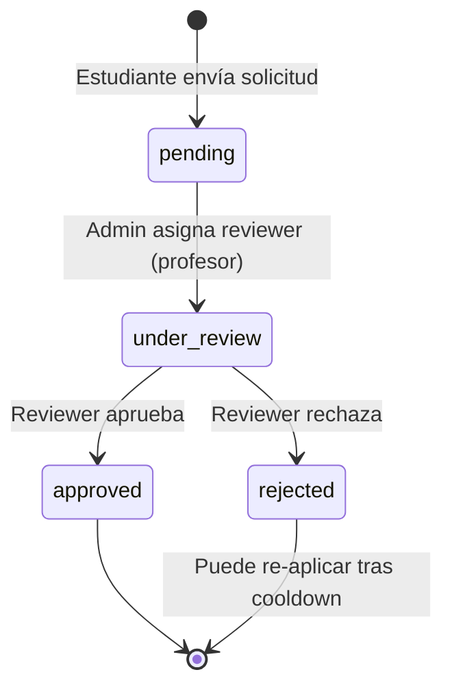
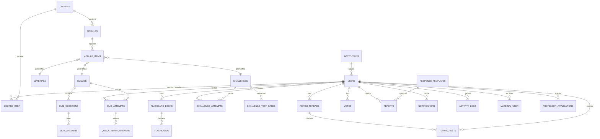

# Plan de Implementación del Backend de Prolecom (v2.0)

Este plan describe los pasos detallados para implementar el backend completo de **Prolecom (Programming Learning Community)** en **Laravel 12** de acuerdo con el diseño técnico aprobado en `docs/02_database_and_api.md`.

> **Directriz de Arquitectura Innegociable (Pragmatic Clean Architecture)**:
> 1. **Capa de Transporte**: Los Controladores (`Controllers`) NO deben contener lógica de negocio. Solo delegan y formatear.
> 2. **Capa de Aplicación (Actions)**: Toda acción que orqueste la entrada de datos, coordine flujos y requiera transacciones de base de datos (`DB::transaction`) debe residir estrictamente en **Acciones (Application Actions)**.
> 3. **Capa de Dominio**: La lógica de negocio pura y reglas del negocio residen en **Servicios de Dominio** y modelos.
> 4. **Atomicidad estricta**: Toda operación que modifique estados sensibles DEBE envolverse en transacciones (`DB::transaction` en la capa de Actions) y utilizar **Pessimistic Locking (`lockForUpdate()`)** para evitar race conditions, especialmente en XP e intentos de quiz.

> [!NOTE]
> **Convención de lectura**: Cada fase lista sus entregables en orden de dependencia. Las sub-secciones marcadas con 🆕 representan funcionalidad nueva incorporada en esta revisión del plan. El conteo total de migraciones personalizadas es **26**.

---

## 1. Fase de Cimientos y Entorno de Desarrollo

### 1.1 Inicialización de Laravel 12
- Instalar un nuevo proyecto Laravel 12 en `/home/jatoapan/code_learning/backend`.
- Instalar dependencias requeridas:
  - `laravel/sanctum` (autenticación)
  - `spatie/laravel-permission` (roles y permisos globales, unificando Support y Supervisor bajo `support`)
  - `pestphp/pest` y `pestphp/pest-plugin-laravel` (para pruebas de testing modernas)

### 1.2 Configuración de Docker Compose (`docker-compose.yml`)
Configurar un entorno unificado que contenga:
- **App Service**: Laravel 12 con PHP 8.2+.
- **Database Service**: MySQL 8.x.
- **Queue Service**: Redis — usado exclusivamente para colas de Laravel (ejecución asíncrona de retos con Judge0 y despacho de notificaciones). No se utiliza para caché ni sesiones.
- **Sandbox Service**: Judge0 CE (para ejecución de código segura).
- **Worker Service**: Worker de Laravel para consumir colas (`php artisan queue:work`).

### 1.4 Capa de Acciones / Casos de Uso (Application Layer) y Servicios de Dominio (Domain Layer)
Para asegurar que el dominio permanezca puro e independiente del framework y ORM, se implementará un diseño desacoplado:
1. **Acciones (Application Layer)**: Clases de caso de uso único bajo `app/Actions` (ej. `RegisterUserAction`, `EvaluateSubmissionAction`). Estas clases orquestan la entrada de datos, manejan los límites de transacciones de base de datos (`DB::transaction()`), y despachan eventos.
2. **Servicios de Dominio (Domain Layer)**: Encapsulan la lógica de negocio pura sin acoplamiento a transacciones de base de datos ni persistencia directa:
   - `GamificationService`: Centraliza la lógica de cálculo de XP local y global.

### 1.3 Configuración del entorno
- Configurar `.env` con `QUEUE_CONNECTION=redis` para que los Jobs de Judge0 y las notificaciones asíncronas funcionen correctamente desde el inicio.
- Verificar conectividad del contenedor App con MySQL, Redis y Judge0 antes de avanzar a la Fase 2.

> **Decisión de arquitectura — Tiempo real**: No habrá mensajería privada en el MVP. Las notificaciones del sistema y las actualizaciones en tiempo real del foro se realizarán utilizando Laravel Reverb (WebSockets). Sin mensajería privada en esta fase.

---

## 2. Fase de Base de Datos y Modelos

### 2.1 Migraciones (26 migraciones personalizadas)

Crear las tablas en el orden correcto de dependencias (claves foráneas primero). A continuación se lista cada migración con sus campos clave, tipos, restricciones e índices.

> [!IMPORTANT]
> Las tablas `personal_access_tokens` (Sanctum) y `notifications` (Laravel nativo) se generan automáticamente con `php artisan sanctum:install` y `php artisan notifications:table` respectivamente. **No** cuentan como migraciones personalizadas.

#### Migración 1 — `institutions`

Representa organizaciones educativas que agrupan usuarios para reportes y análisis institucionales.

| Campo | Tipo | Restricciones |
|:---|:---|:---|
| `id` | `unsignedBigInteger` | PK, Auto Increment |
| `name` | `varchar(255)` | Not Null |
| `slug` | `varchar(255)` | Unique, Not Null |
| `domain` | `varchar(100)` | Nullable, Unique |
| `type` | `enum` | `university`, `bootcamp`, `company` |
| `logo_path` | `varchar(255)` | Nullable |
| `website` | `varchar(255)` | Nullable |
| `created_at` / `updated_at` | `timestamp` | — |

#### Migración 2 — `users`

| Campo | Tipo | Restricciones |
|:---|:---|:---|
| `id` | `uuid` | PK |
| `name` | `varchar(255)` | Not Null |
| `email` | `varchar(255)` | Unique, Not Null |
| `password` | `varchar(255)` | Not Null |
| `avatar_path` | `varchar(255)` | Nullable |
| `status` | `varchar(50)` | Default: 'active' — Estado del usuario (e.g. 'active', 'suspended', 'banned', 'deactivated') |
| `xp` | `unsignedInteger` | Default: `0` |
| `institution_id` | `unsignedBigInteger` | Nullable, FK → `institutions.id` ON DELETE SET NULL |
| `deleted_at` | `timestamp` | Nullable — Soft Delete para cumplimiento de GDPR e irreversible anonimización inmediata |
| `email_verified_at` | `timestamp` | Nullable |
| `created_at` / `updated_at` | `timestamp` | — |

**Índices**: `Unique(email)`, `Index(institution_id)`, `Index(status)`.

---

#### Migración 3 — `courses`

| Campo | Tipo | Restricciones |
|:---|:---|:---|
| `id` | `uuid` | PK |
| `category` | `varchar(50)` | Not Null — Clasificación estática del curso (e.g. 'programming', 'web', 'mobile', 'data_science', 'devops', 'design'). Tipado por Enum en la aplicación |
| `title` | `varchar(255)` | Not Null |
| `slug` | `varchar(255)` | Unique, Not Null |
| `description` | `text` | Not Null |
| `image_path` | `varchar(255)` | Nullable |
| `status` | `varchar(50)` | Default: 'draft' — Estado (e.g. 'draft', 'public', 'unlisted') |
| `has_leaderboard` | `boolean` | Default: `true` |
| `owner_id` | `uuid` | Nullable, FK → `users.id` ON DELETE SET NULL |
| `deleted_at` | `timestamp` | Nullable (Soft Delete) |
| `created_at` / `updated_at` | `timestamp` | — |

**Índices**: `Unique(slug, deleted_at)`, `Index(owner_id)`.

---

#### Migración 4 — `course_user`

Tabla intermedia de inscripciones y staff de cursos. Maneja la arquitectura de roles híbrida (roles locales por curso).

| Campo | Tipo | Restricciones |
|:---|:---|:---|
| `id` | `unsignedBigInteger` | PK, Auto Increment |
| `course_id` | `uuid` | FK → `courses.id` ON DELETE CASCADE |
| `user_id` | `uuid` | FK → `users.id` ON DELETE SET NULL |
| `role` | `varchar(50)` | Rol del usuario dentro del curso (e.g. 'student', 'professor', 'ta') |
| `status` | `varchar(50)` | Estado de la inscripción (e.g. 'enrolled', 'completed', 'dropped') |
| `xp` | `unsignedInteger` | Default: `0` |
| `progress_percent` | `decimal(5,2)` | Default: `0.00` — Porcentaje de progreso cacheado, actualizado vía ProgressObserver |
| `created_at` / `updated_at` | `timestamp` | — |

**Índices**: `Unique(course_id, user_id)`.

---

#### Migración 5 — `modules`

| Campo | Tipo | Restricciones |
|:---|:---|:---|
| `id` | `unsignedBigInteger` | PK, Auto Increment |
| `course_id` | `uuid` | FK → `courses.id` ON DELETE SET NULL |
| `title` | `varchar(255)` | Not Null |
| `description` | `text` | Nullable |
| `order` | `unsignedInteger` | Default: `0` |
| `prerequisite_module_id` | `unsignedBigInteger` | Nullable, FK → `modules.id` ON DELETE SET NULL |
| `deleted_at` | `timestamp` | Nullable (Soft Delete) |
| `created_at` / `updated_at` | `timestamp` | — |

---

#### Migración 6 — `materials`

> **Nota de diseño**: `materials` no tiene `module_id` directo. La relación módulo→material se establece a través de `module_items` (Patrón Composite).

| Campo | Tipo | Restricciones |
|:---|:---|:---|
| `id` | `unsignedBigInteger` | PK, Auto Increment |
| `title` | `varchar(255)` | Not Null |
| `description` | `text` | Nullable |
| `type` | `varchar(50)` | Tipo (e.g. 'pdf', 'video_link', 'ppt', 'pptx') |
| `file_path` | `varchar(255)` | Not Null — URL o path en local/S3 |
| `file_size` | `unsignedBigInteger` | Nullable — Validación de subida (máx. 50MB) |
| `creator_id` | `uuid` | Nullable, FK → `users.id` **ON DELETE SET NULL** — Se establece NULL si el usuario es anonimizado de forma inmediata |
| `deleted_at` | `timestamp` | Nullable (Soft Delete) |
| `created_at` / `updated_at` | `timestamp` | — |

> [!NOTE]
> **Cambio de FK**: La acción FK de `materials.creator_id` es `SET NULL` para compatibilidad con la deactivación inmediata. Un `creator_id` nulo indica que el creador original fue anonimizado en cumplimiento de GDPR.
> 
> **Validación de Archivos**: Al subir archivos de tipo `pdf`, `ppt` o `pptx`, el controlador de carga (Upload Controller) debe validar el MimeType real del archivo contra una lista blanca estricta (`application/pdf`, `application/vnd.ms-powerpoint`, `application/vnd.openxmlformats-officedocument.presentationml.presentation`), impidiendo la subida de ejecutables o scripts maliciosos con extensiones falsas.

---

#### Migración 7 — `material_user`

Seguimiento de materiales visualizados por cada estudiante.

| Campo | Tipo | Restricciones |
|:---|:---|:---|
| `id` | `unsignedBigInteger` | PK, Auto Increment |
| `material_id` | `unsignedBigInteger` | FK → `materials.id` ON DELETE SET NULL |
| `user_id` | `uuid` | FK → `users.id` ON DELETE SET NULL |
| `viewed_at` | `timestamp` | Not Null |

**Índices**: `Unique(material_id, user_id)`.

---

#### Migración 8 — `quizzes`

| Campo | Tipo | Restricciones |
|:---|:---|:---|
| `id` | `unsignedBigInteger` | PK, Auto Increment |
| `title` | `varchar(255)` | Not Null |
| `description` | `text` | Nullable |
| `time_limit` | `unsignedInteger` | Nullable — Minutos |
| `max_attempts` | `unsignedInteger` | Nullable — `NULL` = ilimitado |
| `passing_score` | `decimal(5,2)` | Default: `60.00` — Sobre 100 |
| `random_question_limit` | `unsignedInteger` | Nullable — Si se define, selecciona N preguntas al azar |
| `mode` | `varchar(50)` | 🆕 Modo (e.g. 'practice', 'exam') — Default: 'practice' |
| `answers_visible_after` | `timestamp` | 🆕 Nullable — Solo aplica en modo `exam` |
| `deleted_at` | `timestamp` | Nullable (Soft Delete) |
| `created_at` / `updated_at` | `timestamp` | — |

> 🆕 **Modo examen**: Cuando `mode = 'exam'`, las siguientes reglas de negocio aplican:
> 1. **Intento único**: `max_attempts` se fuerza a `1` independientemente del valor configurado.
> 2. **Timer no pausable**: El tiempo corre de forma continua y no puede detenerse.
> 3. **Respuestas ocultas**: Las respuestas correctas y explicaciones no se revelan al estudiante hasta que `NOW() >= answers_visible_after`. Si `answers_visible_after` es `NULL`, las respuestas permanecen ocultas indefinidamente.

---

#### Migración 9 — `quiz_questions`

| Campo | Tipo | Restricciones |
|:---|:---|:---|
| `id` | `unsignedBigInteger` | PK, Auto Increment |
| `quiz_id` | `unsignedBigInteger` | FK → `quizzes.id` ON DELETE SET NULL |
| `question_text` | `text` | Not Null |
| `type` | `varchar(50)` | Tipo de pregunta (e.g. 'multiple_choice', 'true_false') |
| `points` | `unsignedInteger` | Default: `1` |
| `explanation` | `text` | Nullable — Retroalimentación teórica |
| `created_at` / `updated_at` | `timestamp` | — |

---

#### Migración 10 — `quiz_answers`

Opciones de respuesta para cada pregunta.

| Campo | Tipo | Restricciones |
|:---|:---|:---|
| `id` | `unsignedBigInteger` | PK, Auto Increment |
| `question_id` | `unsignedBigInteger` | FK → `quiz_questions.id` ON DELETE SET NULL |
| `answer_text` | `text` | Not Null |
| `is_correct` | `boolean` | Default: `false` |
| `created_at` / `updated_at` | `timestamp` | — |

---

#### Migración 11 — `quiz_attempts`

| Campo | Tipo | Restricciones |
|:---|:---|:---|
| `id` | `unsignedBigInteger` | PK, Auto Increment |
| `user_id` | `uuid` | FK → `users.id` ON DELETE SET NULL |
| `quiz_id` | `unsignedBigInteger` | FK → `quizzes.id` ON DELETE SET NULL |
| `score` | `decimal(5,2)` | Nota sobre 100 |
| `passed` | `boolean` | Determinado al comparar `score` con `passing_score` |
| `questions_snapshot` | `json` | Nullable — IDs de preguntas presentadas (para `random_question_limit`) |
| `started_at` | `timestamp` | Not Null |
| `completed_at` | `timestamp` | Nullable |
| `created_at` / `updated_at` | `timestamp` | — |

---

#### Migración 12 — `quiz_attempt_answers`

Detalle de cada respuesta enviada en un intento.

| Campo | Tipo | Restricciones |
|:---|:---|:---|
| `id` | `unsignedBigInteger` | PK, Auto Increment |
| `attempt_id` | `unsignedBigInteger` | FK → `quiz_attempts.id` ON DELETE SET NULL |
| `question_id` | `unsignedBigInteger` | FK → `quiz_questions.id` ON DELETE SET NULL |
| `answer_id` | `unsignedBigInteger` | FK → `quiz_answers.id` ON DELETE SET NULL |
| `is_correct` | `boolean` | Not Null |
| `created_at` | `timestamp` | — |

---

#### Migración 13 — `flashcard_decks`

| Campo | Tipo | Restricciones |
|:---|:---|:---|
| `id` | `unsignedBigInteger` | PK, Auto Increment |
| `user_id` | `uuid` | FK → `users.id` ON DELETE SET NULL |
| `title` | `varchar(255)` | Not Null |
| `description` | `text` | Nullable |
| `created_at` / `updated_at` | `timestamp` | — |

---

#### Migración 14 — `flashcards`

Estructura optimizada para el algoritmo de Repetición Espaciada (SRS - SuperMemo SM-2).

| Campo | Tipo | Restricciones |
|:---|:---|:---|
| `id` | `unsignedBigInteger` | PK, Auto Increment |
| `deck_id` | `unsignedBigInteger` | FK → `flashcard_decks.id` ON DELETE SET NULL |
| `question_text` | `text` | Not Null (frente) |
| `answer_text` | `text` | Not Null (reverso) |
| `source_question_id` | `unsignedBigInteger` | Nullable, FK → `quiz_questions.id` ON DELETE SET NULL |
| `next_review_at` | `timestamp` | Default: `CURRENT_TIMESTAMP` |
| `interval` | `unsignedInteger` | Default: `0` — Intervalo en días |
| `repetitions` | `unsignedInteger` | Default: `0` — Repeticiones exitosas consecutivas |
| `ease_factor` | `decimal(5,2)` | Default: `2.50` — Factor de facilidad SM-2 |
| `created_at` / `updated_at` | `timestamp` | — |

---

#### Migración 15 — `challenges`

| Campo | Tipo | Restricciones |
|:---|:---|:---|
| `id` | `uuid` | PK |
| `module_id` | `unsignedBigInteger` | FK → `modules.id` ON DELETE SET NULL |
| `title` | `varchar(255)` | Not Null |
| `description` | `text` | Not Null — Enunciado del problema |
| `difficulty` | `varchar(50)` | Dificultad (e.g. 'easy', 'medium', 'hard') |
| `language_id` | `unsignedInteger` | Not Null — ID del lenguaje en Judge0 |
| `language_name` | `varchar(50)` | Not Null — Nombre legible (ej: Python 3) |
| `starter_code` | `text` | Nullable |
| `points` | `unsignedInteger` | Default: `10` |
| `status` | `varchar(50)` | Estado (e.g. 'draft', 'pending_review', 'approved', 'rejected') |
| `review_feedback` | `text` | Nullable — Retroalimentación al rechazar |
| `creator_id` | `uuid` | Nullable, FK → `users.id` ON DELETE SET NULL |
| `deleted_at` | `timestamp` | Nullable (Soft Delete) |
| `created_at` / `updated_at` | `timestamp` | — |

---

#### Migración 16 — `challenge_test_cases`

| Campo | Tipo | Restricciones |
|:---|:---|:---|
| `id` | `unsignedBigInteger` | PK, Auto Increment |
| `challenge_id` | `uuid` | FK → `challenges.id` ON DELETE SET NULL |
| `input` | `text` | Nullable — Stdin |
| `expected_output` | `text` | Not Null — Stdout esperado |
| `is_hidden` | `boolean` | Default: `false` |
| `created_at` / `updated_at` | `timestamp` | — |

---

#### Migración 17 — `challenge_attempts`

| Campo | Tipo | Restricciones |
|:---|:---|:---|
| `id` | `uuid` | PK (UUID) |
| `user_id` | `uuid` | FK → `users.id` ON DELETE SET NULL |
| `challenge_id` | `uuid` | FK → `challenges.id` ON DELETE SET NULL |
| `submitted_code` | `text` | Not Null |
| `language_id` | `unsignedInteger` | Not Null |
| `status` | `varchar(50)` | Estado (e.g. 'pending', 'accepted', 'wrong_answer', 'compile_error', 'runtime_error', 'time_limit_exceeded') |
| `test_cases_passed` | `unsignedInteger` | Default: `0` |
| `test_cases_total` | `unsignedInteger` | Default: `0` |
| `points_awarded` | `unsignedInteger` | Default: `0` — Solo en primer intento exitoso |
| `execution_time_ms` | `unsignedInteger` | Nullable |
| `execution_memory_kb` | `unsignedInteger` | Nullable |
| `stdout` | `text` | Nullable |
| `stderr` | `text` | Nullable |
| `feedback` | `text` | Nullable — Comentario del profesor/TA |
| `created_at` / `updated_at` | `timestamp` | — |

---

#### Migración 18 — `forum_threads`

| Campo | Tipo | Restricciones |
|:---|:---|:---|
| `id` | `uuid` | PK |
| `forumable_type` | `varchar(255)` | Not Null — Polimórfica: `Course`, `Module`, `Challenge` |
| `forumable_id` | `varchar(36)` | Not Null — Identificador polimórfico (UUID para Course y Challenge, BigInt para Module) |
| `title` | `varchar(255)` | Not Null |
| `body` | `text` | Not Null — Markdown |
| `user_id` | `uuid` | Nullable, FK → `users.id` ON DELETE SET NULL |
| `status` | `varchar(50)` | Estado (e.g. 'open', 'resolved', 'locked', 'hidden') |
| `is_pinned` | `boolean` | Default: `false` |
| `vote_score` | `integer` | Default: `0` — Caché para ordenación rápida |
| `view_count` | `unsignedInteger` | Default: `0` |
| `deleted_at` | `timestamp` | Nullable (Soft Delete) |
| `created_at` / `updated_at` | `timestamp` | — |

**Índices**: `Index(forumable_type, forumable_id)`.

---

#### Migración 19 — `forum_posts`

| Campo | Tipo | Restricciones |
|:---|:---|:---|
| `id` | `uuid` | PK |
| `thread_id` | `uuid` | FK → `forum_threads.id` ON DELETE CASCADE |
| `parent_id` | `uuid` | Nullable, FK → `forum_posts.id` ON DELETE SET NULL |
| `body` | `text` | Not Null — Markdown |
| `user_id` | `uuid` | Nullable, FK → `users.id` ON DELETE SET NULL |
| `is_accepted_answer` | `boolean` | Default: `false` |
| `vote_score` | `integer` | Default: `0` |
| `status` | `varchar(50)` | Estado del post (e.g. 'visible', 'hidden') |
| `deleted_at` | `timestamp` | Nullable (Soft Delete) |
| `created_at` / `updated_at` | `timestamp` | — |

---

#### Migración 20 — `votes` (polimórfica)

| Campo | Tipo | Restricciones |
|:---|:---|:---|
| `id` | `unsignedBigInteger` | PK, Auto Increment |
| `user_id` | `uuid` | FK → `users.id` ON DELETE SET NULL |
| `votable_type` | `varchar(255)` | Not Null — `ForumThread` o `ForumPost` |
| `votable_id` | `uuid` | Not Null — UUID de threads o posts |
| `vote_type` | `tinyInteger` | `1` (upvote) o `-1` (downvote) |
| `created_at` / `updated_at` | `timestamp` | — |

**Índices**: `Unique(user_id, votable_type, votable_id)`.

---

#### Migración 21 — `reports` (polimórfica)

| Campo | Tipo | Restricciones |
|:---|:---|:---|
| `id` | `unsignedBigInteger` | PK, Auto Increment |
| `reporter_id` | `uuid` | FK → `users.id` ON DELETE SET NULL |
| `reportable_type` | `varchar(255)` | Not Null — `ForumThread`, `ForumPost`, `User` |
| `reportable_id` | `uuid` | Not Null — UUID del hilo, respuesta o usuario reportado |
| `reason` | `varchar(50)` | Razón (e.g. 'spam', 'plagiarism', 'offensive_language', 'academic_dishonesty', 'other') |
| `details` | `text` | Nullable |
| `status` | `varchar(50)` | Estado (e.g. 'pending', 'resolved', 'escalated', 'dismissed') |
| `resolved_by` | `uuid` | Nullable, FK → `users.id` ON DELETE SET NULL |
| `resolution_note` | `text` | Nullable |
| `resolved_at` | `timestamp` | Nullable |
| `created_at` / `updated_at` | `timestamp` | — |

---

#### Migración 22 — `response_templates`

Plantillas predefinidas de resolución de denuncias para moderadores.

| Campo | Tipo | Restricciones |
|:---|:---|:---|
| `id` | `unsignedBigInteger` | PK, Auto Increment |
| `title` | `varchar(100)` | Not Null |
| `body` | `text` | Not Null |
| `created_at` / `updated_at` | `timestamp` | — |

---

#### Migración 23 — `activity_logs`

Bitácora de auditoría detallada e ilimitada.

| Campo | Tipo | Restricciones |
|:---|:---|:---|
| `id` | `unsignedBigInteger` | PK, Auto Increment |
| `user_id` | `uuid` | Nullable, FK → `users.id` ON DELETE SET NULL |
| `action` | `varchar(100)` | Not Null |
| `target_type` | `varchar(255)` | Nullable |
| `target_id` | `uuid` | Nullable — UUID del objetivo si aplica |
| `details` | `json` | Nullable |
| `ip_address` | `varchar(45)` | Nullable |
| `created_at` | `timestamp` | — |

---

#### Migración 24 — `module_items` (Patrón Composite)

Estructura el orden unificado del contenido académico del módulo.

| Campo | Tipo | Restricciones |
|:---|:---|:---|
| `id` | `unsignedBigInteger` | PK, Auto Increment |
| `module_id` | `unsignedBigInteger` | FK → `modules.id` ON DELETE SET NULL |
| `itemable_type` | `varchar(255)` | Not Null — `Material`, `Quiz`, `Challenge` |
| `itemable_id` | `varchar(36)` | Not Null — Referencia polimórfica (UUID para retos, BigInt para materiales/quizzes) |
| `order` | `unsignedInteger` | Default: `0` |
| `created_at` / `updated_at` | `timestamp` | — |

**Índices**: `Unique(module_id, itemable_type, itemable_id)`.

---

#### Migración 25 — `system_settings`

Configuraciones dinámicas administrables del sistema.

| Campo | Tipo | Restricciones |
|:---|:---|:---|
| `id` | `unsignedBigInteger` | PK, Auto Increment |
| `key` | `varchar(100)` | Unique, Not Null |
| `value` | `text` | Not Null — Claves sensibles cifradas con `Crypt::encryptString()` |
| `description` | `varchar(255)` | Nullable |
| `created_at` / `updated_at` | `timestamp` | — |

> 🆕 **Nuevas claves de sistema** a registrar en el seeder:
> - `professor_application_cooldown_days` — Período mínimo entre re-solicitudes de rol profesor (default: `90`).

---

#### Migración 26 — `professor_applications`

Solicitudes de estudiantes para ser promovidos al rol global de profesor.

| Campo | Tipo | Restricciones |
|:---|:---|:---|
| `id` | `unsignedBigInteger` | PK, Auto Increment |
| `applicant_id` | `uuid` | FK → `users.id` ON DELETE SET NULL |
| `reviewer_id` | `uuid` | Nullable, FK → `users.id` ON DELETE SET NULL |
| `status` | `varchar(50)` | Estado de la solicitud (e.g. 'pending', 'under_review', 'approved', 'rejected') — Default: 'pending' |
| `motivation` | `text` | Not Null — Carta de motivación del solicitante |
| `qualifications` | `text` | Nullable — Credenciales o experiencia relevante |
| `reviewer_comment` | `text` | Nullable — Retroalimentación del revisor al aprobar o rechazar la solicitud |
| `reviewed_at` | `timestamp` | Nullable |
| `created_at` / `updated_at` | `timestamp` | — |

**Índices**: `Index(applicant_id)`, `Index(reviewer_id)`, `Index(status)`.

**Diagrama de estados** de la solicitud:



---

### 2.2 Diagrama Entidad-Relación (Actualizado)



---

### 2.3 Modelos y Relaciones Eloquent

#### Modelos con `SoftDeletes`
- Contenido académico: `Course`, `Module`, `Material`, `Quiz`, `Challenge`
- Foro: `ForumThread`, `ForumPost`

#### Modelos nuevos 🆕
| Modelo | Tabla | Relaciones principales |
|:---|:---|:---|
| `Institution` | `institutions` | `hasMany(User)` |
| `ProfessorApplication` | `professor_applications` | `belongsTo(User, 'applicant_id')`, `belongsTo(User, 'reviewer_id')` |

#### Relaciones adicionales en modelos existentes 🆕
- **`User`**: Añadir `belongsTo(Institution)`, `hasMany(ProfessorApplication, 'applicant_id')`.
- **`Course`**: Sin relaciones de torneos o equipos.
- **`Challenge`**: Sin relaciones de torneos.

#### Relaciones polimórficas existentes
- `module_items.itemable` → `Material`, `Quiz`, `Challenge`
- `votes.votable` → `ForumThread`, `ForumPost`
- `reports.reportable` → `ForumThread`, `ForumPost`, `User`
- `forum_threads.forumable` → `Course`, `Module`, `Challenge`

---

### 2.4 Observers 🆕

Configurar Eloquent Observers para tareas no bloqueantes y mantenimiento de contadores en caché. Los Observers NO deben ejecutar lógica de negocio bloqueante o sensible como el otorgamiento de XP, que se delega estrictamente a clases de Acción (Actions):

| Observer | Modelo observado | Eventos | Acción |
|:---|:---|:---|:---|
| `VoteObserver` | `Vote` | `created`, `updated`, `deleted` | Recalcula `vote_score` en el `votable` (ForumThread/ForumPost) en caché |
| `ChallengeAttemptObserver` | `ChallengeAttempt` | `updated` | Registra logs de auditoría y despacha eventos para notificaciones. (La lógica de otorgamiento de XP se ha migrado a la acción `EvaluateSubmissionAction`). |
| `ProgressObserver` | `MaterialUser`, `QuizAttempt`, `ChallengeAttempt` | `created`, `updated` | Recalcula el `progress_percent` del estudiante en el curso pivote (`course_user.progress_percent`). Además, intercepta eventos de Soft Delete sobre contenidos académicos (`Material`, `Quiz`, `Challenge`) para recalcular el porcentaje de progreso sobre los elementos activos restantes, garantizando la persistencia e integridad de los puntos de XP que el estudiante ya haya acumulado. |

> [!NOTE]
> Para garantizar la mantenibilidad y evitar efectos secundarios invisibles en operaciones en lote, seeders o actualizaciones automáticas, toda la lógica transaccional de negocio crítica (como el incremento de XP) reside en Actions (Application Layer) en lugar de Observers.

---

### 2.5 Seeders de BD

| Seeder | Contenido |
|:---|:---|
| `RoleSeeder` | Crear roles globales Spatie: `admin`, `support`, `moderator`, `professor`, `student`. |
| `SystemSettingsSeeder` | Claves: `maintenance_mode`, `max_upload_size_mb`, `professor_application_cooldown_days` (🆕, default: `90`). |
| `InstitutionSeeder` 🆕 | Crear 3–5 instituciones de ejemplo (ESPOL, Universidad de Guayaquil, etc.) para desarrollo y pruebas. |
| `DatabaseSeeder` | Cargar usuarios de prueba con sus roles asignados e instituciones vinculadas. |

---

## 3. Fase de Seguridad y Autenticación

### 3.1 Autenticación REST
- Configurar Sanctum para emitir Bearer tokens.
- Implementar `AuthController` con:
  - Registro local (validador de contraseñas ≥ 8 caracteres, hashing con Argon2id).
  - Login local con devolución de Bearer Token.
- Implementar flujo de recuperación de contraseña (`forgot-password` y `reset-password`).
- Implementar endpoint de perfil: `GET /api/v1/user` (datos de cuenta, roles y XP global) y `PUT /api/v1/user` (edición de nombre y avatar).

### 3.2 Middlewares y Seguridad
- `CheckUserStatusMiddleware`: Validar que el usuario no esté `deactivated`, `suspended` o `banned`. Si es así, revocar tokens y denegar acceso con HTTP 403.
- `AuditLogMiddleware`: Registrar acciones críticas en `activity_logs` (acción, usuario, IP, target).
- Configuración de políticas de Laravel (`Policies`) para controlar permisos de creación/edición de hilos, materiales y retos.
- Configurar CORS en `config/cors.php` para permitir peticiones del frontend React.

### 3.3 🆕 Flujo de Solicitud de Rol Profesor (Professor Application)

Permitir que estudiantes soliciten ser promovidos al rol global `professor`. El flujo involucra tres actores: el solicitante (estudiante), el administrador/soporte (asigna revisor) y el revisor (un profesor existente).

#### Endpoints

| Método | Endpoint | Acceso | Descripción |
|:---|:---|:---|:---|
| `POST` | `/api/v1/professor-applications` | Estudiante | Envía solicitud con `motivation` y `qualifications` opcionales. Valida cooldown configurable. |
| `GET` | `/api/v1/professor-applications/mine` | Autenticado | Consulta el estado de la solicitud propia más reciente. |
| `GET` | `/api/v1/professor-applications` | Admin / Support | Lista todas las solicitudes con filtros por `status`. Paginado. |
| `PATCH` | `/api/v1/professor-applications/{id}` | Admin / Support | Asigna un `reviewer_id` (debe tener rol `professor`). Cambia estado a `under_review`. |
| `PATCH` | `/api/v1/professor-applications/{id}` | Profesor (reviewer asignado) | Aprueba (`approved`) o rechaza (`rejected`) con `reviewer_comment` opcional. |

#### Reglas de negocio
1. **Cooldown de re-solicitud**: Si la última solicitud fue `rejected`, el estudiante debe esperar el número de días definido en `system_settings.professor_application_cooldown_days` (default: 90 días) antes de poder enviar una nueva solicitud. Si la última solicitud está en `pending` o `under_review`, no puede crear otra.
2. **Auto-asignación de rol**: Al aprobar la solicitud, el sistema automáticamente:
   - Asigna el rol Spatie `professor` al usuario.
   - Registra la acción en `activity_logs`.
   - Envía notificación interna al solicitante.
3. **Validación de reviewer**: Solo usuarios con rol `professor` pueden ser asignados como revisores. El reviewer no puede ser el mismo solicitante.

### 3.4 🆕 Desactivación de Cuentas y Anonimización Inmediata (Cumplimiento de GDPR)

Al desactivar una cuenta (solicitada por el propio usuario mediante `DELETE /api/v1/users/me` o ejecutada por personal de soporte mediante `PATCH /api/v1/support/users/{id}` con `status = 'deactivated'`), el sistema ejecuta de forma **inmediata e irreversible** una anonimización de datos personales y un Soft Delete, sin período de gracia, para dar cumplimiento al derecho al olvido (Artículo 17 del GDPR).

#### Comportamiento de Anonimización Inmediata (Acción `AnonymizeUserAction`):
1. **Revocación de Sesiones**: Revoca de inmediato todos los tokens de acceso activos de Laravel Sanctum.
2. **Corte de Datos Personales (PII)**: 
   - Reemplaza el campo `name` con `"Usuario Anonimizado"`.
   - Hashea de forma irreversible el correo electrónico (ej. `SHA256(email) + '@anonymized.prolecom.com'`) para mantener la restricción unique de la base de datos pero ocultando la identidad real del usuario de forma irreversible.
   - Borra (`NULL`) el `avatar_path`, `password`, `google_id` y cualquier otro dato identificable de carácter personal (PII).
3. **Registro y Soft Delete**: Registra el evento de anonimización en la tabla de auditoría (`activity_logs`) y ejecuta inmediatamente el Soft Delete del modelo `User` (`deleted_at = NOW()`).

#### Estándar de Retención de Contenido Generado por el Usuario (UGC):
De acuerdo con las excepciones permitidas por el GDPR para fines educativos e interés público de la comunidad (preservación del historial de debates académicos), se establece el siguiente estándar de retención de UGC:
- **Hilos y Respuestas del Foro (UGC)**: Las aportaciones hechas por el usuario en los foros Q&A (`forum_threads` y `forum_posts`) **no se eliminan físicamente** para evitar romper la coherencia pedagógica y la estructura de los debates. 
- **Desasociación e Identidad**: La relación `user_id` de sus hilos y respuestas se establece a `SET NULL` (o se asocia a un registro placeholder anonimizado), y cualquier campo que asocie las aportaciones a datos personales es eliminado, mostrando dichas participaciones en la interfaz de usuario bajo la firma de "Usuario Anonimizado".
- **Historial Académico**: Las visualizaciones de materiales (`material_user`), intentos de cuestionarios (`quiz_attempts`) y entregas de retos (`challenge_attempts`) se conservan únicamente con fines de cálculo de métricas agregadas y analíticas históricas de cursos, desasociados de cualquier dato de carácter personal.

---

## 4. Fase de Cursos, Módulos, Syllabus y Notificaciones

### 4.1 Gestión de Cursos y Catálogo
- Implementar listado de categorías y catálogo de cursos con filtros (título, categoría, dificultad).
- Implementar CRUD de cursos (profesor): creación pública/privada, edición de metadatos y soft delete.

### 4.2 Inscripción y Solicitudes
- Implementar flujo de inscripción: abierta (automática) y por solicitud (pendiente de aprobación del profesor).
- Implementar gestión de solicitudes de inscripción: listar, aprobar y rechazar.

### 4.3 Syllabus y Módulos
- Implementar endpoint de Syllabus: retornar módulos con sus `module_items` ordenados por el patrón Composite.
- Implementar CRUD de módulos con soporte de `prerequisite_module_id` para bloqueo secuencial.
- Implementar reordenamiento de `module_items` dentro de un módulo.

### 4.4 Progreso, Gamificación y Leaderboard
- Implementar cálculo de progreso ponderado del estudiante (materiales vistos + quizzes aprobados + retos resueltos) y acumulación de XP local y global.
- Implementar Leaderboard del curso ordenado por XP local.
- Implementar estadísticas del curso para el profesor: promedio de avance, retos conflictivos y listado de candidatos a TA por XP.
- Implementar asignación y remoción de TAs en un curso.

### 4.5 🆕 Analíticas del Curso

Calcular y exponer de forma dinámica las métricas de rendimiento del curso ejecutando agregaciones con Eloquent (`withCount()`, `withAvg()`, etc.) sobre los modelos correspondientes. Para optimizar el rendimiento, se puede cachear el resultado de la consulta por un período corto (ej. 5-10 minutos).

| Método | Endpoint | Acceso | Descripción |
|:---|:---|:---|:---|
| `GET` | `/api/v1/courses/{id}/analytics` | Profesor (Owner) / Admin | Calcula y retorna métricas consolidadas: total de inscripciones, estudiantes activos, completaciones de quizzes, promedio de calificación, retos resueltos y progreso promedio. |

**Respuesta de ejemplo**:
```json
{
  "data": {
    "course_id": 12,
    "total_enrollments": 85,
    "active_students": 72,
    "total_quiz_completions": 340,
    "avg_quiz_score": 74.50,
    "total_challenge_solves": 215,
    "avg_progress_percent": 62.30,
    "calculated_at": "2026-06-01T10:30:00Z"
  }
}
```

### 4.6 Sistema de Notificaciones Internas

Implementar el sistema de notificaciones usando la tabla nativa `notifications` de Laravel para los siguientes **10 eventos**:

| # | Evento | Destinatario |
|:---|:---|:---|
| 1 | Solicitud de inscripción recibida (approval_required) | Profesor (owner del curso) |
| 2 | Inscripción aprobada o rechazada | Estudiante solicitante |
| 3 | Nuevo hilo publicado en foro del curso | Profesores y TAs del curso |
| 4 | Respuesta a un hilo propio | Autor del hilo |
| 5 | Respuesta marcada como aceptada/correcta | Autor del post aceptado |
| 6 | Reto de TA aprobado o rechazado por el profesor | TA creador del reto |
| 7 | Reporte escalado a soporte | Equipo de soporte |
| 8 | Torneo abierto para inscripción | Estudiantes inscritos en el curso |
| 9 | Torneo iniciado | Participantes registrados en el torneo |
| 10 | Resultados del torneo publicados | Participantes registrados en el torneo |

#### Endpoints de notificaciones

| Método | Endpoint | Acceso | Descripción |
|:---|:---|:---|:---|
| `GET` | `/api/v1/notifications` | Autenticado | Lista notificaciones del usuario autenticado (paginado). |
| `PATCH` | `/api/v1/notifications/{id}` | Autenticado | Body `{"is_read": true}`. Marca una notificación como leída. |
| `PATCH` | `/api/v1/notifications` | Autenticado | Body `{"is_read": true}`. Marca todas como leídas. |
| `GET` | `/api/v1/notifications/unread-count` | Autenticado | Devuelve el conteo de no leídas. (Nota: Se prefiere WebSockets via Laravel Reverb para tiempo real). |

#### Correo electrónico
- Implementar envío de email para eventos críticos (inscripción aprobada, suspensión de cuenta, solicitud de profesor aprobada/rechazada).

---

## 5. Fase de Foro Q&A y Mensajería Privada

### 5.1 Foro de Discusión
- Implementar endpoints de hilos y posts del foro con soporte de Markdown.
- Implementar middleware de visibilidad del foro restringido por progreso del alumno (403 si el módulo está bloqueado).
- Implementar upvote/downvote con actualización del campo `vote_score` en caché via Observer.
- Implementar validación de respuestas correctas (marcar como solución, con XP para el autor).
- Implementar pinning y bloqueo de hilos por profesor o moderador.

## 6. Fase de Quizzes y Flashcards (SRS)

### 6.1 CRUD de Quizzes
- Implementar CRUD de Quizzes con preguntas de opción múltiple y verdadero/falso.
- Implementar envío de quiz con selección aleatoria de preguntas (respetando `random_question_limit`), calificación automática y prevalencia de la nota más alta.
- Implementar visualización de explicaciones teóricas en preguntas falladas al revisar un intento.

### 6.2 🆕 Soporte de Modo Examen

Extender la lógica de quizzes para soportar el campo `mode` con dos valores: `practice` (default) y `exam`.

#### Diferencias de comportamiento por modo

| Aspecto | `practice` (default) | `exam` |
|:---|:---|:---|
| **Intentos** | Ilimitados (o según `max_attempts`) | Siempre 1 — el campo `max_attempts` se ignora |
| **Timer** | Pausable (el estudiante puede salir y volver) | No pausable — el reloj corre continuo desde `started_at` |
| **Respuestas visibles** | Inmediatamente tras completar | Ocultas hasta `answers_visible_after` (o indefinidamente si es `NULL`) |
| **Explicaciones** | Disponibles al revisar intento | Sujetas a la misma regla de visibilidad |

#### Implementación técnica

1. **Endpoint `POST /api/v1/quizzes/{id}/submit`** — Antes de aceptar el envío:
   - Si `mode = 'exam'`, verificar dentro de la Acción correspondente (`SubmitQuizAttemptAction`, la cual inicia la transacción `DB::transaction()`) con `lockForUpdate()` que no exista ningún `quiz_attempt` previo para este usuario+quiz antes de crear el nuevo intento. Si existe, retornar HTTP 403 con mensaje descriptivo. Esto previene race conditions en doble-envío simultáneo.
   - Si `time_limit` está definido y `mode = 'exam'`, verificar que `NOW() - started_at <= time_limit`. Si se excedió, auto-calificar con las respuestas recibidas hasta ese momento.

2. **Endpoint `GET /api/v1/quiz-attempts/{id}`** — Al retornar el detalle del intento:
   - Si el quiz tiene `mode = 'exam'` y `NOW() < answers_visible_after`, omitir los campos `is_correct` en cada respuesta y `explanation` en cada pregunta. Incluir un campo `answers_available_at` en la respuesta para que el frontend muestre un countdown.

3. **Endpoint de creación/edición de quiz** — Validaciones adicionales:
   - Si `mode = 'exam'`, el campo `time_limit` es obligatorio (no puede ser `NULL`).
   - `answers_visible_after` solo es aceptado cuando `mode = 'exam'`; si se envía con `mode = 'practice'`, ignorarlo.

### 6.3 Flashcards y SRS
- Implementar importación automática de flashcards desde preguntas falladas de un intento de quiz.
- Implementar algoritmo SRS (SuperMemo SM-2) para programar repasos diarios de tarjetas: actualización de `next_review_at`, `interval`, `repetitions` y `ease_factor` según la calificación del usuario.
- Implementar generación dinámica de quizzes de práctica en memoria a partir de las flashcards de un mazo.

---

## 7. Fase de Retos y Judge0

### 7.1 Retos y Flujo de Aprobación
- Implementar CRUD de retos y casos de prueba (con campos `input`, `expected_output` e `is_hidden`).
- Implementar flujo de aprobación/rechazo de retos creados por TAs: estado `pending_review` → `approved` o `rejected`, guardando `review_feedback` en el rechazo.

### 7.2 Ejecución Asíncrona con Judge0
- **Job `EvaluateSubmissionJob`**: envía el código a Judge0, espera el veredicto asíncrono y, al obtener el resultado final, invoca la acción `EvaluateSubmissionAction` para guardar el resultado de manera transaccional.
- **Acción `EvaluateSubmissionAction`**:
  - Recibe el veredicto de Judge0.
  - Inicia una transacción de base de datos (`DB::transaction`).
  - Usa Pessimistic Locking (`lockForUpdate()`) para verificar si el usuario ya ha resuelto este reto exitosamente con anterioridad.
  - Si el veredicto es `accepted` y es la primera vez que el estudiante resuelve este reto:
    - Otorga los puntos de XP del reto sumándolos tanto a nivel local (`course_user.xp`) como a nivel global (`users.xp`).
    - Actualiza el `progress_percent` en `course_user`.
  - Actualiza el estado del `challenge_attempt` (ej. `accepted`, `runtime_error`, `wrong_answer`).
  - **Emite un evento de Laravel Reverb (`ChallengeAttemptEvaluated`)** para notificar al frontend en tiempo real.
- **Endpoint de submit (`POST /api/v1/challenges/{id}/submit`)**: encola el Job y responde de inmediato con el `attempt_id` y status `pending`.
- **(ELIMINADO) Endpoint de polling**: El frontend ya no debe hacer polling. Recibirá el resultado instantáneo vía WebSocket escuchando el canal privado del usuario.

---

## 8. Fase de Moderación, Soporte, Admin y Búsqueda

### 8.1 Sistema de Denuncias y Moderación
- Implementar sistema de denuncias polimórficas (hilos, posts y usuarios) con razones tipificadas.
- Implementar panel de reportes para el moderador: cola de denuncias pendientes, aplicación de plantillas predefinidas y acciones (`dismiss`, `hide_content`, `suspend_user`, `ban_user`).
- Implementar escalado de reportes a soporte técnico.
- Implementar avales de moderación (endorsements) en hilos, posts y materiales de estudio.

### 8.1.1 🆕 Gestión de Cursos (Moderación)
- El moderador o profesor puede fijar (pin) o bloquear (lock) hilos del foro para detener nuevas respuestas.
- El moderador puede otorgar avales (`moderator_endorsed_at`) en hilos y posts para destacarlos.

### 8.2 Gestión de Usuarios (Soporte)
- Implementar gestión de usuarios para soporte técnico/supervisor: desactivación de cuentas (revocación de tokens + cambio de status + soft delete y anonimización de datos de manera inmediata) y reasignación de roles Spatie.

### 8.3 Panel de Administración
- Implementar visualización paginada y filtrada de logs de auditoría para el administrador (`GET /api/v1/admin/logs`).
- Implementar panel de configuración global del sistema (`system_settings`): modo mantenimiento, límites de subida, cooldown de aplicaciones de profesor.

### 8.4 🆕 Gestión de Instituciones (Admin)

CRUD completo de instituciones educativas y acceso a sus analíticas dinámicas.

| Método | Endpoint | Acceso | Descripción |
|:---|:---|:---|:---|
| `GET` | `/api/v1/admin/institutions` | Admin | Lista todas las instituciones con filtros (nombre) y paginación. |
| `POST` | `/api/v1/admin/institutions` | Admin | Crea una nueva institución. |
| `PUT` | `/api/v1/admin/institutions/{id}` | Admin | Edita nombre, slug, logo y sitio web de una institución. |
| `DELETE` | `/api/v1/admin/institutions/{id}` | Admin | Elimina una institución. Los usuarios vinculados reciben `institution_id = NULL`. |
| `GET` | `/api/v1/admin/institutions/{id}/analytics` | Admin | Retorna las métricas de la institución: total de usuarios, profesores, estudiantes y cursos, calculados dinámicamente en tiempo real con cacheo opcional. |

### 8.5 🆕 Listado Público de Instituciones

| Método | Endpoint | Acceso | Descripción |
|:---|:---|:---|:---|
| `GET` | `/api/v1/institutions` | Autenticado | Lista instituciones disponibles. Usado en el formulario de registro/perfil para que el usuario seleccione su institución. |

---

## 9. Fase de Pruebas y Verificación

### 9.1 Pruebas Automatizadas (Pest PHP)

Implementar suite de pruebas automatizadas organizada por dominio funcional:

#### 9.1.1 Autenticación y Seguridad
- Registro local (validación de contraseña, hashing Argon2id).
- Login local y obtención de Bearer token.
- Flujo de recuperación de contraseña.
- Revocación de tokens al cerrar sesión.
- `CheckUserStatusMiddleware`: bloqueo de acceso para usuarios `suspended`, `banned` y `deactivated`.

#### 9.1.2 Control de Acceso por Roles
- Verificación de permisos por rol Spatie (admin, support, moderator, professor, student).
- Verificación de roles locales por curso (professor, ta, student).
- Acceso denegado a recursos de otros cursos.

#### 9.1.3 🆕 Flujo de Solicitud de Profesor
- Enviar solicitud como estudiante (caso exitoso).
- Rechazar solicitud duplicada si existe una `pending` o `under_review`.
- Validar cooldown de re-solicitud tras rechazo.
- Admin asigna reviewer (validar que sea profesor).
- Reviewer aprueba → verificar que el rol `professor` se asigna automáticamente.
- Reviewer rechaza → verificar `reviewer_comment` y que el rol **no** cambia.
- Verificar que la notificación se despacha al solicitante.

#### 9.1.4 Cursos, Inscripción y Prerrequisitos
- CRUD de cursos (crear, editar, soft delete).
- Inscripción automática en curso público.
- Inscripción manual de estudiantes por profesor o TA (cursos unlisted).
- Bloqueo de acceso a módulos con prerrequisitos no completados.
- Progreso ponderado del estudiante.

#### 9.1.5 Retos de Programación
- Endpoint de submit que retorna `attempt_id` con `status = 'pending'`.
- Recepción asíncrona del veredicto final vía WebSocket (Laravel Reverb).
- Otorgamiento de XP solo en el primer intento exitoso.

#### 9.1.6 Quizzes y Flashcards
- Calificación automática de quiz con prevalencia de nota más alta.
- Selección aleatoria de preguntas (`random_question_limit`).
- Visualización de explicaciones en preguntas falladas.
- Repetición espaciada SRS: calificar tarjeta y verificar recálculo de `next_review_at`, `ease_factor`.
- Generación de quiz de práctica desde mazo de flashcards.
- Importación de preguntas falladas como flashcards.

#### 9.1.7 🆕 Modo Examen
- Quiz en modo `exam`: verificar que solo se permite un intento.
- Quiz en modo `exam`: verificar que si ya existe un `quiz_attempt`, el segundo envío retorna HTTP 403.
- Quiz en modo `exam`: verificar que las respuestas correctas y explicaciones se ocultan antes de `answers_visible_after`.
- Quiz en modo `exam`: verificar que las respuestas se revelan después de `answers_visible_after`.
- Quiz en modo `exam`: verificar que `time_limit` es obligatorio en la creación.
- Quiz en modo `practice`: verificar que se permiten múltiples intentos y las respuestas son inmediatamente visibles.

#### 9.1.8 Foro Q&A
- CRUD de hilos y posts con Markdown.
- Upvote/downvote y actualización de `vote_score` (via Observer).
- Marcar respuesta como aceptada (con XP para el autor).

#### 9.1.9 Moderación, Notificaciones y Auditoría
- Denuncia de hilos, posts y usuarios.
- Resolución de denuncias con plantillas y acciones.
- Escalado de reportes a soporte.
- Despacho y lectura de notificaciones internas.
- Registro de acciones en `activity_logs`.

#### 9.1.10 🆕 Analíticas (Cálculo Dinámico)
- Verificar que el endpoint `GET /api/v1/courses/{id}/analytics` calcule y devuelva el total correcto de inscripciones al inscribir un nuevo usuario.
- Verificar que el endpoint `GET /api/v1/courses/{id}/analytics` incremente las completaciones de quiz y recalcule la nota promedio tras aprobar un quiz.
- Verificar que el endpoint `GET /api/v1/courses/{id}/analytics` refleje el total de retos resueltos tras una entrega aceptada.
- Verificar que el endpoint `GET /api/v1/admin/institutions/{id}/analytics` calcule y devuelva el conteo correcto de usuarios e instituciones afiliadas.

#### 9.1.11 🆕 Desactivación y Anonimización (GDPR y Soft Delete)
- Desactivar usuario por soporte → verificar `status = 'deactivated'` y que ocurre anonimización inmediata de datos personales.
- Usuario se auto-desactiva vía `DELETE /api/v1/users/me` → verificar mismo comportamiento (status `deactivated`, soft delete y anonimización de datos).
- Verificar revocación de tokens al desactivar.
- Verificar registro en `activity_logs` antes del soft delete y la anonimización.

#### 9.1.12 🆕 Instituciones (CRUD y Analíticas)
- Admin crea institución.
- Admin edita institución.
- Admin elimina institución → verificar que usuarios quedan con `institution_id = NULL`.
- Admin consulta analíticas de institución.
- Listado público de instituciones (autenticado).
- Acceso denegado a endpoints de admin para roles no-admin.

### 9.2 Pruebas Manuales
- Comprobación de endpoints clave usando archivos HTTP (REST Client de VS Code o Postman).
- Verificación del comportamiento del contenedor Docker de Judge0 local.
- Validación del flujo completo de notificaciones (evento → BD → WebSockets con Laravel Reverb).
- Verificación del flujo de solicitud de profesor end-to-end.
- Verificación del comportamiento de la desactivación y anonimización inmediata de cuentas.

---

## 10. Log de Cambios (MVP Scoping & Clean-up)

A continuación se resume la bitácora de cambios realizados sobre los documentos `docs/02_database_and_api.md` y `docs/03_backend_logic.md` para adaptar la arquitectura al alcance MVP simplificado:

1. **Eliminación de Mensajería Privada**:
   - Se removió por completo la mensajería 1:1, incluyendo la tabla `messages` y sus respectivos endpoints del plan. La comunicación asíncrona se delega por completo a los foros Q&A.

2. **Remoción de Google OAuth**:
   - Se eliminó el paquete `laravel/socialite` y los flujos asociados de login por Google, limitando el alcance a registro e inicio de sesión local mediante correo y contraseña.

3. **Simplificación de Inscripciones**:
   - Se eliminó el flujo de solicitudes con aprobación/rechazo del profesor y las limitaciones de capacidad. Se definieron cursos como `public` (auto-inscripción) o `unlisted` (inscripción manual del profesor/TA).

4. **Remoción de Gamificación Compleja (Torneos y Equipos)**:
   - Se eliminaron las tablas `teams`, `team_members`, `tournaments`, `tournament_challenges`, `tournament_participants` y `tournament_submissions` de la planificación. La gamificación del MVP se apoya exclusivamente en el XP local y global por resolver retos, cuestionarios y visualizar materiales.

5. **Eliminación de Gemini API**:
   - Se removió la integración de IA asíncrona para pistas de retos (AI Tutor) y generación de contenidos (AI Creator) para simplificar la infraestructura y la fase de pruebas automatizadas.

6. **Desactivación Inmediata de Cuenta**:
   - Se descartó el período de gracia de 30 días y el Job cron diario `PurgeDeactivatedUserJob`. Al desactivar la cuenta (por soporte o auto-desactivación del usuario), el sistema ejecuta de forma inmediata la anonimización de datos personales y el soft delete.

7. **Ajuste de Notificaciones**:
   - Se redujo el alcance del módulo de notificaciones internas de 10 eventos a 5 eventos prioritarios, eliminando aquellos relacionados con torneos, equipos y aprobación de matrículas.

8. **Recálculo de Tablas y Migraciones**:
   - El total de tablas del sistema se redujo de 35 a **28** (incluyendo nativas).
   - El número total de archivos de migración personalizados pasó de 34 a **26**.
   - Los endpoints del sistema se redujeron de 158 a **122**.
